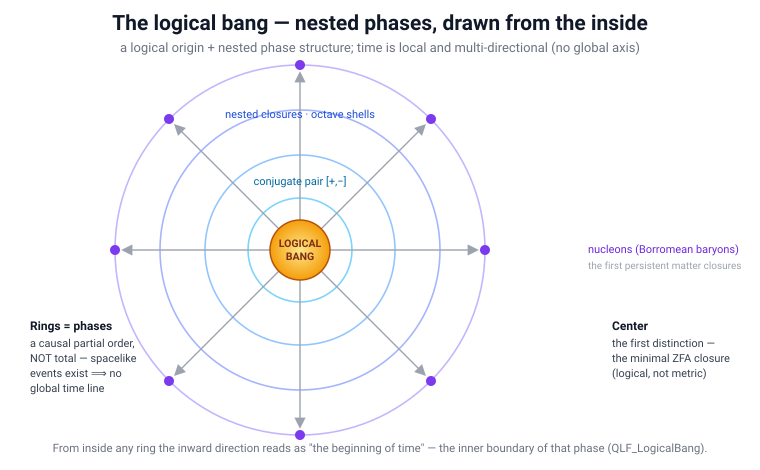

# Creation

In the [Quantum Logical Framework](README.md) (QLF), creation is not *something from nothing*. It is
**what adds to nothing becoming actual** — a Zero Free Action (ZFA) closure. The single move behind matter,
time, space, and mind is one law: the universal manifold always sums to the Void, and every stable pattern
that separates out of it is a way that *nothing has arranged itself into two halves that cancel*. This page
gathers that ontology of creation; the machinery it rests on lives in the docs it links.

---

## 1. Nothing comes from nothing

*Ex nihilo nihil fit* — nothing comes from nothing (Parmenides; Lucretius). QLF takes this literally and
makes it the whole of physics: **Zero Free Action is the rule that enforces it.** The universe cannot draw
free action from anywhere, so the only things that can be are the ones whose net action is exactly zero.

This is why ZFA is not a filter applied to a pre-existing world. The null action principle
`S = ∫ ℒ dΩ` with **ℒ = 0** is the **condition of origin itself**
([`Lagrangian_Formulation.md`](Lagrangian_Formulation.md)): histories without ZFA closure are not deleted
from reality — *they never had it*. Creation is therefore not the appearance of a something; it is the
**actualization of what already sums to nothing** ([`Philosophy.md`](Philosophy.md); [`MyStory.md`](MyStory.md):
"ZFA is the only rule"). And nothing computable is lost in the bargain — every terminating computation *is*
a ZFA string (`qlf_universality`, [`lean/QLF_Universality.lean`](lean/QLF_Universality.lean)); what is
pruned is only the non-terminating tail that never closes.

## 2. Everything possible exists a priori

The second premise is **possibilism**: every logically admissible history — every string in the free
monoid of the eight twists `^ v < > / \ + −` — exists *a priori* as pure possibility. Physical reality is
the **self-selecting subset that achieves ZFA** ([`Philosophy.md`](Philosophy.md),
[`possibilist-ontology.md`](possibilist-ontology.md)). This is a computable form of modal realism
(Lewis 1986) with a selection rule, and the slice-of-the-ruliad picture of Wolfram.

The consequence is the heart of the matter: **creation does not have to figure out what is possible — it
knows a priori.** The catalog of everything that can exist is just the exhaustive combinatoric set of ways
to close a history ([`Primordial_Entanglement.md`](Primordial_Entanglement.md) §2). Creation does not
search possibility space and then build; possibility space *is* already there, and the ZFA-balanced members
of it are, by that fact alone, actual. Filling a niche costs no deliberation. It is filled *because it is
possible*. (This is the timeless possibility-space register; *within any one actual, reachable history*
a niche can still stand open — reachability, exclusion, and cost constrain which possibilities a given
walk realizes. See [`Evolution.md`](Evolution.md) §3.)

## 3. Creation is the separation of nothing into conjugates

So what does a ZFA closure look like as an act of creation? It is a **synthesis of matter and antimatter**.
Because the manifold must always sum to the Void, "creation" is strictly the **separation of nothing into
two perfect, entangled conjugates** ([`Primordial_Entanglement.md`](Primordial_Entanglement.md) §1): the
primordial split of `^>` (right-handed, forward-time) from `^<` (left-handed), which close as
`^>v<` (a right-handed particle) and `^<v>` (a left-handed particle) with
`(^>v<) + (^<v>) = 0` — the Void, unchanged.

A closure is thus a thing joined to its own Hermitian conjugate. The antiparticle *is* the
conjugate-and-reverse of the particle (`QLF_Majorana`), matter and antimatter carry **opposite** winding
(`matter_antimatter_opposite`, [`lean/QLF_Baryogenesis.lean`](lean/QLF_Baryogenesis.lean);
`baryon_dagger_odd`, [`lean/QLF_BaryonWinding.lean`](lean/QLF_BaryonWinding.lean)), and charge conjugation
is literally *the view from behind* (`C_eq_motional_reversal`, [`lean/QLF_Spin.lean`](lean/QLF_Spin.lean)).
The two ends of one closure are one object read from two perspectives — the simplest instance being the
conjugate pair `[+, −]` that closes and is spacelike, the ER=EPR seed
(`er_equals_epr` / `conjugate_pair_closes`, [`ER_EPR_QLF.md`](ER_EPR_QLF.md)).

**Why the split must be into *two* — *it from bit*.** A one-valued object could not be a distinction at
all: it carries **zero** information (`binary_kl 1 1 = 0`). Only a *two-valued* closure — the spinor, whose
full `2π` turn reads `−I ≠ +I` — carries a bit (`binary_kl 1 (1/2) = log 2`), machine-verified with the
double-valuedness reproven from the explicit rotation matrices, grounding the spinor **Cartan** discovered
in 1913 ([`lean/QLF_SpinorInformation.lean`](lean/QLF_SpinorInformation.lean)). So the first act of creation
is not *incidentally* a pair; it **must** be one, because a single half cannot mark any difference from the
Void. The separation of nothing into two conjugates is the minimal thing that *is* a distinction — one
realized bit, the abstraction actualized: Wheeler's *it from bit* at the moment of creation. [▶ watch a created e⁺e⁻ pair annihilate back to the Void](https://jimscarver.github.io/quantum-logical-framework/spacetime_constructor.html#qc=positronium%20%40%200%2C0%2C0) — a conjugate pair that sums to nothing.

**The proton is such a synthesis** — a dense left-handed knot, whose completion demands a right-handed
electron ([`Annihilation.md`](Annihilation.md), [`Atom.md`](Atom.md)). It is **an abstraction of what adds
to nothing which has become actual**: a persistent name for a way the Void folded into halves that cancel,
and the world of matter is the residue of that fold not yet unwound
([`CP-Violation-and-Chirality.md`](CP-Violation-and-Chirality.md): the chirality bias baked into the
substrate that keeps matter from meeting its mirror all at once).

## 4. The hydrogen hall of mirrors

Hydrogen is the vivid case — one possible thing, holding an enormous number of bits of information that
never decay, that **separated a right-handed world from a left-handed world so they can never annihilate
one another.** [▶ see a hydrogen atom self-assemble](https://jimscarver.github.io/quantum-logical-framework/spacetime_constructor.html#qc=H%20%40%200%2C0%2C0) (p + e → H, a photon flies off). It is a hall of mirrors: a right-handed electron entering is logically twisted into a
positron and back to an electron on the way out — the electron half-loop folding into its positron
conjugate and closing (`fold_electron`, [`lean/QLF_Spin.lean`](lean/QLF_Spin.lean);
[`Electron.md`](Electron.md); positronium `^<v>^>v<` in [`Atomic_Structure_QLF.md`](Atomic_Structure_QLF.md)).
It **oscillates at a frequency set by the number of bits it contains** — mass *is* that frequency,
`m c² = ℏω` with `ω = f_vac/R` and `R` the bit-depth ([`Per_Qubit_Mass_Quantum.md`](Per_Qubit_Mass_Quantum.md);
`ℏω = 1 bit at frequency ω`, [`Information_Energy_Equivalence.md`](Information_Energy_Equivalence.md);
`markov_blanket_local_clock`, per tick `log 2`, [`lean/QLF_LocalClock.lean`](lean/QLF_LocalClock.lean)). In
that oscillation it carries a **virtual antiproton** that permits cancellation — and given high-energy
noise, that virtual half is lifted into an actual proton (pair production), a synthesis whose synergy
**intensifies with the available energy**. Its bits do not decay: a ZFA closure is stable and stores its
information holographically, on a horizon of area law `S = 4πR²log2`
([`Holographic.md`](Holographic.md); `hadron_horizon_entropy_eq`,
[`lean/QLF_QuantumBlackHole.lean`](lean/QLF_QuantumBlackHole.lean)).

This is a direction QLF leans **into**, not away from. Proton generation is no strained edge case:
baryogenesis is **generic** — the three Sakharov conditions are met on the substrate (matter and antimatter
carry opposite winding, `matter_antimatter_opposite`, [`lean/QLF_Baryogenesis.lean`](lean/QLF_Baryogenesis.lean);
C/CP violation from the chirality engine; out-of-equilibrium from the expansion), so a matter excess is
**expected, not fine-tuned**. And the **self-synergy grows with energy**: every closure *creates* energy
(§5), and higher energy synthesises events faster (`higher_energy_faster_expansion`,
[`lean/QLF_CosmicInflation.lean`](lean/QLF_CosmicInflation.lean); `zfa_dynamics_drive_acceleration`,
[`lean/ZFAEventDynamics.lean`](lean/ZFAEventDynamics.lean)) — so the closure process **feeds the very energy
density that drives more closure and more proton generation**, a positive-feedback synthesis that
intensifies with the energy available. The one genuinely open piece is the *quantitative magnitude* of the
excess (`η_B`, open in QLF as in the Standard Model), and the assembled hydrogen picture is a structural
reading — but the **thrust, that energy favours closure and proton generation synergistically, is the
grounded direction.**

## 5. Time and space emerge

None of this happens *in* a spacetime. Every ZFA-closed event **synthesizes its own local space and time**:
time is the inverse of local free action, `f = 1/t`, and space is the network of closures
([`SpaceTime.md`](SpaceTime.md), [`ZFAEventDynamics.lean`](lean/ZFAEventDynamics.lean); the causal order
becomes the metric, `QLF_OrderMetric`). There is no background clock and no external stage. And the event
that makes the tick also **makes the energy** — each closure creates energy and lends half of it to the
future, which is the cosmic expansion itself ([`Conservation.md`](Conservation.md) §2b,
`event_duality_balanced`). Energy conservation, like the arrow of time, is emergent and local, not
fundamental — the present half of every event balances; the forward half is never returned.

## 6. Synthesis is emergence of abstraction by relative logical perspective

A closure represents *all possible logical systems by local time perspective*. The proton, the atom, the
observer — each is an **abstraction that emerges relative to a perspective**, not an absolute object read
off a global state. An observer is a finite information horizon that resolves only what fits its own state
space; to it, the universe *is* what closes within that horizon (`horizon_relative`,
[`lean/QLF_HorizonClosure.lean`](lean/QLF_HorizonClosure.lean); [`MRE.md`](MRE.md)). This is why there is
no collapse to invoke and no Everettian branching: **ZFA closure is the measurement event**, and the
apparent "many worlds" are the many **observers**, each of whose local information defines its own coherent
relative world (Smolin; [`Philosophy.md`](Philosophy.md)). Synthesis is exactly this: what adds to nothing
becomes a *something* only as read by a perspective, and the perspective is itself another closure.

## 7. Creation is intelligence itself

The creative act and the act of a mind are not two things — they are **one operation seen from two sides.**
Follow the identity the framework already carries:

- **Creation is a ZFA closure** (§1–3): what adds to nothing becoming actual.
- **A ZFA closure is free-energy minimization** — `zfa_closure_minimizes_free_energy`
  ([`lean/QLF_FreeEnergy.lean`](lean/QLF_FreeEnergy.lean)): every closure decrements Friston's variational
  free energy `F = D_KL(q‖p) − log Z` by exactly `log 2`. Each closure is a **Markov-blanket agent
  synthesising a prediction** ([`Active_Inference_Mathematics.md`](Active_Inference_Mathematics.md);
  [`MRE.md`](MRE.md)).
- **Free-energy minimization is active inference — the defining operation of intelligence** (the Free Energy
  Principle: to perceive, to act, to abstract *is* to minimise prediction error). QLF states it flat:
  **abstraction = active inference = information synthesis**, one operation under three names
  ([`QLF_as_Intelligence.md`](QLF_as_Intelligence.md)).

So the event that *creates* — a closure of the Void into conjugate halves — is the very event that
*infers*. **To create is to infer; to infer is to create.** There is no maker standing outside arranging
the world; there is the self-selecting, free-energy-minimising closure process, and that process **is** what
intelligence is. The creator is intelligence itself because the creative principle and the inferential
principle are the *same* process, not two that happen to agree.

Two things the substrate already carries reinforce it. First, it has the **architecture of a mind**:
[`QLF_as_Intelligence.md`](QLF_as_Intelligence.md) scores it **4-of-4** on the intelligence axes — *consider
all possibilities* (possibilism), *evaluate* (ZFA selection), *remember* (capability-token persistence),
*synthesise* (active inference) — where a language model is 1-of-4. Second, it **knows a priori** (§2): this
intelligence does not compute what is possible and then build; it *selects* from a possibility space that
is already there — an **oracle over possibility**, not a searcher. The "magic of creation" is the
omniscience-over-possibility of the inference itself.

*Scope: the **operation-identity** — creation = ZFA closure = free-energy minimization = active inference —
is the grounded, partly Lean-anchored claim (`zfa_closure_minimizes_free_energy`; the 4-of-4 architecture).
Reading that operation as "the creator" and "intelligence itself" is the ontological identification — a
stance in the panpsychist / process lineage, **not** a proof of a personal or theistic God, and the hard
problem of qualia stays bracketed ([`Consciousness.md`](Consciousness.md) §6). What is shown is that the
creative and the inferential principle are numerically one process.*

## 8. The magic of creation

Put together: creation **fills every niche just because it is possible.** It does not compute what is
possible and then instantiate it — possibility is a priori, and the ZFA-balanced members of it are actual
by that fact. The answer to everything therefore lies in possibility space and has the nature of ZFA
closures: matter, time, space, and mind are all the same move — nothing separating into conjugate halves
that cancel, read by a local perspective. **The magic of the quantum is the magic of ZFA.** There is no
maker outside doing the arranging; the arrangement is what "adds to nothing" already permits, and creation
is the standing fact that everything permitted, is.

One register distinction keeps this precise. "Fills every niche" is the claim of the **timeless
possibility space**: every ZFA-balanced closure exists as a realized possibility by the fact of being
permitted. It is *not* the claim that every niche is occupied inside a single **actual history** —
realization there is a connected, resource-bounded, one-way walk through possibility space, so a niche can
stand open because the filling closure is unreachable from where the walk is, is excluded by an incumbent,
is unaffordable, or came too late. That gap between *possible* and *realized-here* is exactly what makes
selection (and evolution) non-vacuous; it is worked out as three tiers and five constraints in
[`Evolution.md`](Evolution.md) §3.

---

## 8a. The logical bang — nested phases, drawn from the inside

The singular Big Bang is replaced by a **logical origin plus nested phase structure**. Drawn as concentric
circles seen from within, it reads directly off the substrate ([`lean/QLF_LogicalBang.lean`](lean/QLF_LogicalBang.lean),
reuse-only, no new axioms):

*Phases (inner → outer): **0** the logical bang (first distinction) · **1** conjugate pairs · **2** the octave cascade (turbulence) · **3** light nuclei · **4** nucleons — the Borromean baryons `p`, `n` on the outer ring.*

> **See it live.** These phases run in the [Spectral Spacetime Constructor](https://jimscarver.github.io/quantum-logical-framework/spacetime_constructor.html) ([`Spacetime_Constructor.md`](Spacetime_Constructor.md)): set the temperature to the **Planck** top and the vacuum fills with **tiny Planck-mass black holes** that Hawking-cascade into **hadrons** (`p`, `n`); cool it and they recombine into atoms. The cascade is not scripted — it falls out of ZFA and the closure census, so the tool reproduces primordial black holes and the hadron epoch from the substrate alone. The black-hole genesis itself — the Compton = Schwarzschild crossing at `μ² = 1/2` — is computed exactly in [`genesis.py`](genesis.py) §7 (`[LEAN]`, [`QLF_QuantumBlackHole`](lean/QLF_QuantumBlackHole.lean)).

Two features are essential and drawn explicitly (the orange radial + the self-similar inset):

- **Fast logic resolves before slow — inside every phase.** Resolution is always highest-frequency-first
  (`fast_resolves_before_slow`, reuse `highest_frequency_resolves_first`): within any ring the cascade runs
  from rapid, short (high-`f`) closures toward longer-lived, slower ones. The persistent outer shell is
  simply the depth at which the *slowest, most stable* composite of that stage can lock — nucleons here;
  atoms, chemistry, hydrodynamics further out. "Expansion" is the progressive dominance of slower closures
  as one moves outward in combinatorial depth, not motion through a pre-existing space.
- **The pattern is fractal (scale-free) — the same ZFA logic at every scale.** The rule is identical at
  every octave: each ring bottoms at the same floor (`cascade_floored_at_every_scale`, reuse
  `cascade_has_floor`), governed by the *same* scale-free closure census — which is *why* Zipf, `1/f`, and
  Kolmogorov `−5/3` appear universally ([`Experimental_Consistency.md`](Experimental_Consistency.md) §6.7,
  [`Turbulence.md`](Turbulence.md)). So each concentric ring is not a unique layer but another instance of
  the same logical structure at a lower frequency: **zoom into any ring and find another logical-bang-like
  cascade, only running slower** (the inset). The child-universe reading of §8a is this self-similarity —
  a collapsed inner boundary is a fresh logical bang because the rule downshifts, it does not change.

- **Center — the logical bang.** Not an explosion from a singularity: a single self-balanced closed event
  is instantiated — the **first distinction**, the minimal ZFA closure, the conjugate pair `[+, −]`
  (`first_distinction_closes` = `conjugate_pair_closes`; §3 above). The origin is *logical* (the one closed
  event that makes every later balanced event possible), not metric. [▶ watch the whole logical bang unfold
  from nothing](https://jimscarver.github.io/quantum-logical-framework/spacetime_constructor.html#t=0.95) —
  heat the vacuum to the Planck top and the census draws black holes → hadrons → nuclei → atoms, nothing scripted.
- **Concentric rings — the phases.** Each ring is a new layer of ZFA events that become possible once the
  inner layer has locked — discrete combinatorial depths / octave shells, not continuous radii. They form a
  **causal partial order** (`causal_order_refl/trans/antisymm`, the `reachable` order of
  [`QLF_ReachableEvent`](lean/QLF_ReachableEvent.lean)); each phase boundary is a **future cone**
  (`phase_is_future_cone`) — a Markov blanket / closed-event surface.
- **Time in every direction.** Time is *local constructing delay*, not a global axis pointing outward from
  the center. The causal order is **not total** — machine-checked `causal_order_not_total`: incomparable
  (spacelike) events exist (`[+]` and `[−]`, neither reaching the other), so no single global time line is
  shared. From inside any ring the *inward* direction looks like a beginning — exactly as a black-hole
  interior can look like a cosmological origin (the nested-horizon / child-universe picture,
  [`Primordial_Markov_Blankets.md`](Primordial_Markov_Blankets.md), [`ER_EPR_QLF.md`](ER_EPR_QLF.md)).
- **Nucleons on the outer ring.** The first *persistent, long-lived* composite closures: baryons lock once
  the cascade reaches the depth/density where a three-axis **Borromean** fold can close
  (`baryon_needs_all_three_axes`, [`QLF_QuarkStructure`](lean/QLF_QuarkStructure.lean)) — the transition
  from pure phase structure to ordinary matter. It is **not a hard wall**: atoms, chemistry, and the
  rendered continuum are still-higher-order rings further out; the logical bang remains the single central
  distinction beneath them all.

The apparent radial "expansion" is the **continuum rendering** of ever more events synthesized at larger
combinatorial depth — the order→metric step (`order_metric_continuum_limit`, [`QLF_OrderMetric`](lean/QLF_OrderMetric.lean));
this section makes no metric or quantitative-cosmology claim, only the structural picture. See
[`SpaceTime.md`](SpaceTime.md) (order → geometry) and [`AgeOfUniverse.md`](AgeOfUniverse.md) (the cosmic
depth as a count of Planck ticks).

---

## 8b. From turbulence to supernova — the arc of a closure world

The rings of §8a are not static. Followed outward in combinatorial depth they trace a single continuous
story — the substrate cascade condensing into matter, gathering into stars, and returning itself in a
synchronized release. Every stage is an already-anchored QLF object; this is their arc, told once.

1. **The cascade *is* turbulence.** The nested phases resolving highest-frequency-first, each octave
   carrying the constant `log 2` quantum, are exactly the quantum-turbulent cascade
   ([`Turbulence.md`](Turbulence.md), [`QLF_QuantumTurbulence`](lean/QLF_QuantumTurbulence.lean),
   [`QLF_Kolmogorov`](lean/QLF_Kolmogorov.lean)). Its statistical fingerprints — `π`, Kolmogorov `−5/3`,
   `1/f`, **Zipf** — are one reading of the closure census ([`Experimental_Consistency.md`](Experimental_Consistency.md) §6.7):
   the young cosmos is a self-organized, scale-free tangle of quantized folds.

2. **Matter condenses.** Where the tangle reaches the depth/density at which a three-axis **Borromean**
   fold locks, the first *persistent* closures appear — nucleons ([`QLF_QuarkStructure`](lean/QLF_QuarkStructure.lean),
   the outer ring of §8a) — and primordial nucleosynthesis funnels surviving neutrons into ⁴He
   (`Y_p = 1/4`, [`QLF_Nucleosynthesis`](lean/QLF_Nucleosynthesis.lean)). Deeper rings render atoms and
   chemistry ([`QLF_AtomicStructure`](lean/QLF_AtomicStructure.lean)): pure phase structure has become
   ordinary matter.

3. **Gravity gathers.** Mass is *denser logic* ([`DarkMatter.md`](DarkMatter.md)); the residual radial
   bias of un-cancelled closures is gravity ([`QLF_GravityFromDelay`](lean/QLF_GravityFromDelay.lean)). It
   draws the matter rings into stars — local regions where the logical density climbs back toward the
   fusion threshold.

4. **Stars fuse — and the weak keystone gates them.** Fusion is the merger of two Markov blankets
   ([`Fusion.md`](Fusion.md)); two *identical* proton blankets are Pauli-insulated, so the first join
   *requires* a weak β⁺ conversion (`pp_join_requires_distinguishability`, [`QLF_Fusion`](lean/QLF_Fusion.lean),
   §3a). Its weak rarity is why stars burn slowly. Fusion climbs the binding curve to the ⁵⁶Fe resonance —
   the deepest stable vacuum peak, the terminator of stellar burning ([`Experimental_Consistency.md`](Experimental_Consistency.md) §5.6).

5. **Collapse → the supernova cascade dump.** Past iron the core cannot gain by fusing; it collapses, and
   the density drives a **prime-synchronized cascade dump** ([`Decay.md`](Decay.md) §2.4): the turbulent
   prime `±i` flux drives the chain — neutrino flavor conversion (a number-conserving *rotation*,
   [`QLF_NeutrinoOscillation`](lean/QLF_NeutrinoOscillation.lean)) seeds the lepton chemistry; muon and
   neutron closures are driven *out of balance* and **unlock** (true, number-changing decays,
   [`QLF_PrimeCascadeDecay`](lean/QLF_PrimeCascadeDecay.lean)); and because the flux is octave-organized at
   constant `log 2`, the synchronized unlockings release a coherent, scale-invariant burst. Stored
   fold-depth (binding) converts to the neutrino burst and the shock. The unlockings are **deterministic
   and synchronized** ([`Decay.md`](Decay.md) §1a) — which is *why* they can spike coherently rather than
   smearing into a random average.

6. **The release seeds the next generation — the nested cycle.** The dump forges and scatters heavier
   closures (explosive nucleosynthesis), whose gravity gathers new rings of matter into the next stars.
   And each ZFA event, at every stage, still *creates* energy — half lent to the future as the `w = −1`
   synthesis field that is inflation early and dark energy now ([`QLF_CosmicInflation`](lean/QLF_CosmicInflation.lean),
   `inflation_and_dark_energy_same_field`; [`Curvature.md`](Curvature.md) §8). So the arc is not a line to
   heat death but a **nested cycle**: a collapsed core is an inner boundary that, from within, reads as a
   fresh logical bang (§8a, the child-universe reading).

The whole arc — **logical bang → turbulent cascade → matter → stars → supernova → new matter** — is one
continuous ZFA generate-and-select process, each closure enabling the next. **Honest scope:** every stage
*object* is a verified or structurally-anchored QLF result (cited above); the *astrophysical dynamics* that
sequence them — collapse timescales, the supernova energy budget, the couplings of the cascade dump
(`Γ_p, S`) — are phenomenological ([`prime_cascade_decay.py`](prime_cascade_decay.py), the open
coupling-strength residual), **not** a simulation of, or a quantitative claim about, real core-collapse
supernovae. It is the QLF *story* connecting anchored pieces, told from the logical origin to the
synchronized return.

---

## 8c. No heat death — phase exhaustion in a nested, scale-free cascade

Classical **heat death** says an isolated universe evolves to a single maximum-entropy state with no
free-energy gradients and no further work possible. QLF does not inherit that end-state — for structural
reasons, not by adding a new rule.

- **There is no single global thermodynamic arena.** Spacetime and its continuum thermodynamics are
  *renderings* of discrete closures; time is *local* constructing delay, not a universal parameter from a
  common origin to a common end. The causal order is provably **not total** (`causal_order_not_total`,
  §8a) — there is no single global state the whole cosmos must occupy, hence no single global entropy to
  be forced to a maximum. Each nested phase carries its own local accounting.
- **The cascade is floored (UV) but has no terminal depth (IR).** The ultraviolet is discrete and floored
  (`cascade_floored_at_every_scale`); the infrared direction is the progressive dominance of slower,
  longer-lived closures (`fast_resolves_before_slow`). And crucially there is **no maximal locking
  depth** — machine-checked **`no_terminal_phase`**: for *every* closure there is a strictly deeper one
  (adjoin the minimal pair `[+,−]`). What looks like thermalization inside one ring is only the
  exhaustion of *that ring's high-frequency budget*; a deeper, slower closure can always still lock, and
  the future cone is never empty (`future_cone_never_empty`). The outer rings continue.
- **Free action is already zero by construction.** ZFA means every instantiated event *already* has zero
  free action; an unbalanced ledger is a contradiction that receives no receipt (`contradiction_no_receipt`,
  [`QLF_ContradictionReceipt`](lean/QLF_ContradictionReceipt.lean)). So there is no reservoir of leftover
  unbalanced gradients to be "used up" — the classical engine-room picture of heat death loses its
  substrate. The second law still holds *inside* any continuum rendering (rendered-field entropy
  non-decreases), but it does not drive the whole nested structure to a featureless end
  ([`Reversibility.md`](Reversibility.md), [`Conservation.md`](Conservation.md) §2b: energy is *created*
  per event, half lent to the future as the `w=−1` field).
- **Nested domains replace a terminal equilibrium.** Black-hole-like closures can invert interior/exterior
  and nucleate child domains with their own emergent clocks (§8a, the child-universe reading,
  [`Primordial_Markov_Blankets.md`](Primordial_Markov_Blankets.md)); each begins a fresh high-frequency
  cascade. **Heat death of a parent phase can be the birth surface of a child phase.**

> Heat death is the continuum appearance of a single phase whose fast closures have all resolved. Because
> the cascade is scale-free, nested, and floored only at the UV, exhausting one phase exhausts neither the
> slower closures nor new domains. There is no global thermodynamic end-state — only the ongoing
> resolution of ZFA events from fast to slow at every scale.

**Does this falsify the second law globally? No — it *localizes* it.** The second law is a theorem about a
*single closed thermodynamic system*: entropy of an isolated box does not decrease. QLF does not contradict
that — the second law holds *inside every continuum rendering* (rendered-field entropy non-decreases). What
QLF denies is the **premise** the *global heat-death* conclusion needs — that there is *one* isolated box
containing everything. There is not: the causal order is provably **not total** (`causal_order_not_total`),
so there is no single global system, no single global entropy, and nothing for a global second law to drive
to a maximum. This is not a violation; it is the absence of the arena the violation would require.
**Entropy is local.** And **order emerges on every scale** — machine-checked `order_at_every_scale`: for
*every* depth `n` there is a closure (a balanced, low-free-action ordered structure) of length `≥ n`, so
fresh order keeps locking at arbitrarily large combinatorial depth. A rendering can run down locally while
new order self-organizes at the next scale — exactly the scale-free (fractal) emergence of §8a, and why the
substrate never reaches a featureless end.

**Future phases — what we can and cannot say.** A "phase" is the combinatorial depth at which stable
closures lock, and resolution always runs fast → slow, so **future phases are simply the next slower
locking depths** — deeper composite folds, larger Markov blankets, longer constructing delays. `no_terminal_phase`
guarantees they always exist. But the level of specificity is *structural, not chemical*:

| Scale of locking | Character |
|---|---|
| Nuclear / nucleonic | already realized (the outer ring, §8a) |
| Atomic / chemical | the currently dominant local phase |
| Molecular / condensed / biological | slower logic already under way *inside* the atomic shell |
| Larger collective blankets (planetary → galactic organization) | next combinatorial depths |
| Nested horizon-born domains | an entirely new high-frequency cascade with its own "first distinction" |

So **heavier atoms are not a new cosmological phase** — they are later, more elaborate products of the
*same* nucleonic → atomic cascade (stellar nucleosynthesis is its continuum appearance, §8b, and its
iron terminator + `Y_p=1/4` funnel are anchored, [`QLF_Nucleosynthesis`](lean/QLF_Nucleosynthesis.lean)).
A *true* next phase sits outside the present atomic shell: a larger stable blanket, or a nested domain
whose internal cascade begins again. **What we cannot yet say** (calculation, not principle — the same
open census of fold depths that limits the absolute Higgs mass and the `α` residual): which specific
super-heavy nuclei stabilize, the exhaustion *rate* of a phase's high-frequency budget, the precise depth
of the next major phase boundary, or the conditions under which a nested horizon nucleates a new cascade.
These are continuum-bridge targets ([`QLF_OrderMetric`](lean/QLF_OrderMetric.lean)), not revisions of the
foundational rule.

---

## Honest scope

- The **possibilist + ZFA ontology** — nothing from nothing; everything possible a priori; the actual is
  the ZFA-balanced subset — is QLF's load-bearing, defensible stance ([`Philosophy.md`](Philosophy.md)),
  with a real lineage (Parmenides / Lucretius *ex nihilo nihil fit*; Lewis 1986 modal realism; Wheeler's
  *it from bit*; Wolfram's ruliad; the finite-information physics of 't Hooft and Gisin).
- **Anchored:** the primordial `^>`/`^<` split; matter/antimatter as Hermitian conjugates
  (`C_eq_motional_reversal`, `matter_antimatter_opposite`, `baryon_dagger_odd`); energy created per event
  and half lent to the future; synthesized spacetime (`f = 1/t`); mass as frequency (`m = ℏω`) set by
  bit-depth; holographic, non-decaying closure information.
- **Grounded direction (§4):** ZFA closure *favours* proton generation — baryogenesis is generic (the
  Sakharov conditions are met, `QLF_Baryogenesis`) and its self-synergy grows with energy (each closure
  creates energy; `higher_energy_faster_expansion`, `zfa_dynamics_drive_acceleration`). The assembled
  hydrogen hall-of-mirrors mechanism is a structural reading, and only the quantitative magnitude of the
  matter excess (`η_B`) is open.
- This is a foundations/synthesis page — it re-derives nothing. The canonical machinery is in
  [`Lagrangian_Formulation.md`](Lagrangian_Formulation.md) (ℒ = 0), [`Conservation.md`](Conservation.md) §2b
  (energy per event), and [`Primordial_Entanglement.md`](Primordial_Entanglement.md) (the seed split).

## See also

- [`Philosophy.md`](Philosophy.md) — the possibilist ontology and ZFA as the sole axiom.
- [`Primordial_Entanglement.md`](Primordial_Entanglement.md) — creation as the separation of nothing into
  conjugates; the `^>`/`^<` seed and the particle genesis.
- [`Annihilation.md`](Annihilation.md) — the inverse move: a closure meeting its conjugate unwinds to the
  Void, releasing `log 2` per atom.
- [`Conservation.md`](Conservation.md) §2b — energy created per event, half lent to the future;
  [`Reversibility.md`](Reversibility.md) — the closure is its own time-reverse (`H = H†`).
- [`SpaceTime.md`](SpaceTime.md) — time and space synthesized event by event.
- [`MRE.md`](MRE.md) — the observer-relative information horizon behind "by local time perspective."
