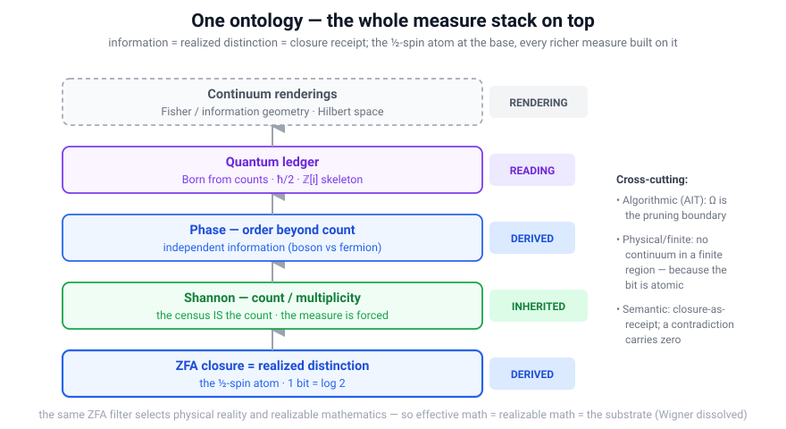
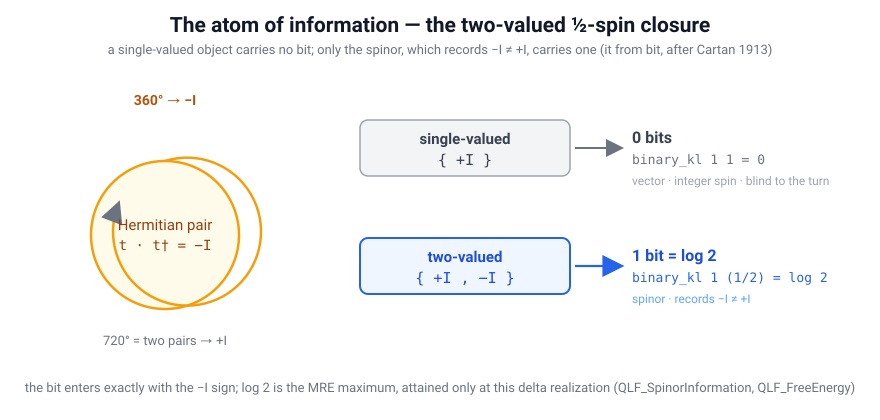

# Information Physics in QLF — what information *is*, and the notions it grounds

> **"It from bit" made constructive.** Information is not a measure laid on top of physics; in
> the [Quantum Logical Framework (QLF)](README.md) it **is** the physics. The universe is the
> subset of logical possibility that achieves Zero Free Action (ZFA) closure, and each closure
> *is* a resolved distinction — one realized bit. This document collects the many notions of
> information (Shannon, algorithmic, Fisher, von Neumann/quantum, Bekenstein/holographic,
> Landauer, semantic) and shows, with machine-checked proofs where they exist, how each sits on
> QLF's substrate: **inherited** (a measure QLF sits *on*), **derived** (falls out of counting
> closures), or **rendering** (an emergent continuum object).

This is the physics-and-mathematics-of-information companion to
[`Related_Frameworks.md`](Related_Frameworks.md) Part II (which places these notions as a *measure
stack over an unspecified ontology*), [`Mathematics_From_QLF.md`](Mathematics_From_QLF.md) (the
emergence ladder), and [`TheContinuum.md`](TheContinuum.md) (why a finite universe cannot hold
continuum information). It gathers the scattered results — [`MRE.md`](MRE.md),
[`Shannon_And_Phase.md`](Shannon_And_Phase.md), [`Shannon_Overfit.md`](Shannon_Overfit.md),
[`Information_Energy_Equivalence.md`](Information_Energy_Equivalence.md),
[`Relative_Entropy.md`](Relative_Entropy.md), [`Entropy.md`](Entropy.md),
[`Born_Rule.md`](Born_Rule.md) — into one map.

---

## 0. The one-paragraph thesis

Existing mathematics of information is a stack of **measure theories over an unspecified
ontology**: Shannon *counts* distinctions, algorithmic information *prices* descriptions, Fisher
*measures* sensitivity, quantum information *ledgers* resources — **none says what a distinction
*is*, or when one has *happened***. QLF supplies that missing bottom layer:

> **Information = realized distinction = closure receipt.** The abstraction (a two-valued
> distinction) is primary; a ZFA closure is its physical *realization*. The atom is the
> **spin-½ closure**, carrying exactly one bit; every richer measure lives on top.

The priority runs **abstraction → physical** (Wheeler's *it from bit*): information *is* the
distinction, and matter/spacetime is what realizing distinctions *looks like*. "Information is
physical" (Landauer) is then the downstream **toll** — realizing a bit is finite and costs
`ΔF = −log 2` — not a reduction of information to matter.

**Quick map.** Every notion of information is one of four things on the substrate:

| Notion | Status | Core claim |
|---|---|---|
| Bit / ½-spin atom | **derived** | one bit = a two-valued ZFA closure |
| Shannon | **inherited** | the census *is* the count |
| Phase | **derived** | independent of the count |
| Algorithmic (AIT) | **boundary** | `Ω` = the pruning horizon |
| Physical / finite | **derived** | no continuum in a finite region |
| Quantum | **reading** | `ℤ[i]` skeleton + Born from counts |
| Fisher | **rendering** | emerges in the continuum limit |
| Semantic | **contributes** | a contradiction carries zero |

**How to read this.** *Information theorists:* §2–§4 (Shannon, phase, AIT) — what QLF inherits and where it adds. *Physicists:* §5–§6 (Bekenstein/Landauer, quantum) + the frequency bridge in §1 — the energy/spacetime toll. *Mathematicians:* §1, §8 + [`Mathematics_From_QLF.md`](Mathematics_From_QLF.md) — the atom as the seed of the emergence ladder. Each section marks its status: **machine-checked**, **reading**, **rendering**, **forward work**, or **ontological stance** (collected in §10).

---

## 1. The atom of information — one bit is one half-spin closure

**Claim.** The minimal unit of information is the two-valued **spin-½ closure**. A *single-valued*
object cannot express a distinction (carries zero information); a *two-valued* one — the spinor,
whose `2π` turn reads `−I ≠ +I` — carries exactly one bit.

**Proof (machine-checked, [`lean/QLF_SpinorInformation.lean`](lean/QLF_SpinorInformation.lean)).**
Write the binary Kullback–Leibler divergence of a recognition density `q` from a prior `p`,
`D(q‖p) = q·log(q/p) + (1−q)·log((1−q)/(1−p))` (`binary_kl`).

- **Single-valued alphabet `{+I}`** (a prior with one outcome, `p = 1`): resolving it costs
  `D(1‖1) = 1·log 1 + 0·log(0/0) = 0` nats (`single_valued_zero_information`). *A one-valued
  object marks no difference — the formal content of "it cannot express information."*
- **Two-valued alphabet `{+I, −I}`** (uniform prior `p = 1/2`, delta realization `q = 1`):
  `D(1‖½) = 1·log 2 = log 2` nats — exactly one bit (`two_valued_one_bit`).
- **The jump happens exactly at the `−I` sign.** `spin_half_is_information_atom`: `0 < log 2`,
  and the increment is admitted precisely when the double-cover sign `−I ≠ +I` enters.

**Why the *spinor*, not a vector — Cartan (1913).** The `−I` is the double-valued sign of the
`SU(2) → SO(3)` cover, `π₁(SO(3)) = ℤ₂`. It is reproven here from the explicit rotation matrices:
a full `2π` turn is `+I` on the vector (`SO(3)`) representation but `−I` on the spin-½ (`SU(2)`)
representation (`spinor_double_valued_vector_blind`, via `Complex.exp_pi_mul_I`). A vector factors
through `SO(3)` and is *blind* to the winding; the spinor records it. This is the substrate
instance of Cartan's classification of the non-tensorial (spinor) representations of the
orthogonal groups. See [`Mathematics_From_QLF.md`](Mathematics_From_QLF.md) § "Rung 5a".

**MRE saturation — the bit is the *maximum*, and it is unique.** On the uniform binary prior,
`D(q‖½) = log 2 − H(q)` with `H` the binary entropy (`binary_kl_uniform_eq_log_two_sub_entropy`),
and `H(q) > 0` for `q ∈ (0,1)` (`binary_entropy_pos`). Hence `D(q‖½) < log 2` for every spread-out
`q` (`binary_kl_uniform_lt_log_two`), with the bound `log 2` attained **only** at the delta
realization — the half-spin ZFA closure. So the spin-½ closure is the *unique* event shape that
both closes and extracts the maximum information per fold: **Maximum Relative Entropy**
([`MRE.md`](MRE.md) §2.1, [`lean/QLF_FreeEnergy.lean`](lean/QLF_FreeEnergy.lean)).

**The atom is also the elementary clock — information *is* the physics.** Space is the set of
positions of ZFA closures; time is the local clock frequency, `f = 1/latency`
([`Time.md`](Time.md), [`SpaceTime.md`](SpaceTime.md)). The *same* ½-spin closure that carries one
bit sets one tick — so **frequency is not an extra physical quantity; it is the rate at which
distinctions are realized**, and mass/energy are `m = ℏf/R`, `E = ℏω` per bit (§5). That is the
concrete content of "information *is* the physics," not a slogan: watch it run — every dot a
closure, colour its frequency — in the interactive constructor
([live](https://jimscarver.github.io/quantum-logical-framework/spacetime_constructor.html),
[`Spacetime_Constructor.md`](Spacetime_Constructor.md)).

---

## 2. Shannon information — count / multiplicity (inherited)

**Classical (Shannon 1948).** Information is the reduction of uncertainty over distinguishable
alternatives; entropy `H = −Σ pᵢ log pᵢ` measures multiplicity. Shannon *explicitly disclaims
meaning* (1948: semantics is "irrelevant to the engineering problem").

**QLF relation — pure inheritance.** The closure **census** *is* Shannon counting on the
substrate. Information composes additively because multiplicities multiply:

**Proof ([`lean/QLF_CensusShannon.lean`](lean/QLF_CensusShannon.lean)).** For independent
closures joined in parallel, `W(A ∥ B) = W(A)·W(B)` (`independent_join_multiplies`); a single bit
has multiplicity `2` (`bit_multiplicity`), `n` independent bits multiplicity `2ⁿ`
(`nbit_multiplicity`), so `information = log W` is additive (`multiplicity_composes`). The `log 2`
per closure and the Landauer bridge `ΔF = −log 2` are the per-event quantum
([`lean/QLF_FreeEnergy.lean`](lean/QLF_FreeEnergy.lean)).

**The measure is *forced*, not chosen.** Any information functional that is additive over
independent joins is pinned uniquely: on a length-`|s|` uniform census it must equal `|s|·c`, and
`c` is fixed by its value on one generator (`additive_unique`,
[`lean/QLF_EntropyUniqueness.lean`](lean/QLF_EntropyUniqueness.lean)). This is the finite/counting
wing of the **Baez–Fritz–Leinster** category-theoretic uniqueness of Shannon entropy and of
**Knuth**'s "structure forces the measure" — executed on the substrate. (The full distributional
`−Σ p log p` uniqueness is the analytic residual.)

---

## 3. Shannon is necessary but *not sufficient* — phase is independent information

**Claim.** The permutation-invariant *count* (Shannon) does not determine the physics; the
**order (phase)** it discards carries independent information.

**Proof ([`lean/QLF_PhaseInformation.lean`](lean/QLF_PhaseInformation.lean)).** Two histories with
the **identical twist multiset** — hence identical Shannon content — can fold to **opposite** Pauli
scalars: `^v<>` → `+I` (a boson / 720° closure, `fold_udlr`) versus `^<v>` → `−I` (the electron's
360° fermion sign, `fold_uldr`, reusing `QLF_Spin.fold_electron`). The count cannot tell them
apart; the phase can — and here the difference *is* spin statistics
(`count_does_not_determine_phase`, `shannon_necessary_not_sufficient`). The same non-count
structure carries time (`f = 1/t`) and mass (`m = ℏf/R`) as frequency
([`Shannon_And_Phase.md`](Shannon_And_Phase.md)). So Shannon is a floor, not the whole story: QLF's
state ring is the Gaussian integers `ℤ[i]`, whose phase `μ₄ = {±1, ±i}` is exactly the information
Shannon throws away ([`The_QLF_State_Space.md`](The_QLF_State_Space.md)).

---

## 4. Algorithmic information (Kolmogorov–Chaitin) — the fantasy boundary

**Classical (Kolmogorov 1965; Chaitin 1975).** The information in an object is the length of its
shortest program; a real is *lawful* iff it has a finite program.

**QLF relation — the sharpest statement of the boundary.** Algorithmic Information Theory makes
QLF's "fantasy tier" **quantitative**. The non-identifiable tail of the overfit theorems
([`Shannon_Overfit.md`](Shannon_Overfit.md), `tail_unconstrained`) is exactly the reals of
**infinite Kolmogorov complexity**; **Chaitin's `Ω`** (the halting probability) sits on the
boundary — *definable yet uncomputable*, the canonical fantasy object with a name. QLF's response
is not a dodge but the correct discipline: the core lives strictly within **`RCA₀`**, below the
Busy-Beaver / `Ω` horizon ([`ReverseMathematics.md`](ReverseMathematics.md)), and `full_zeno_prune`
*is* the physical realization of the pruning boundary — non-terminating computations never achieve
ZFA closure. **AIT prices descriptions; ZFA says which descriptions get receipted.**

---

## 5. Physical and finite information (Bekenstein, Gisin, Landauer)

**Classical.** Landauer (1961): *information is physical* — erasing one bit dissipates `k_B T ln 2`.
Bekenstein (1981): a finite region holds *finite* information (bounded by area). Gisin
(2019): a single real number carries infinite information, so no physical quantity is a real.
Zeilinger–Brukner (2003): an elementary system carries *one bit*.

**QLF relation — derived, and it explains *why* finiteness bites.** The Bekenstein/Gisin bound
turns on information being **quantized**: a region holds finitely many distinctions *because each
distinction is a whole bit* — the atomic ½-spin closure of §1 — not an infinitely-divisible sliver.

**Proof ([`lean/QLF_Realizability.lean`](lean/QLF_Realizability.lean)).** With the Bekenstein bound
as premise (a region's distinguishable states form a *finite* type) and a faithful realization
modeled as an injection, there is **no injection from an infinite state space into a finite one**
(`no_continuum_in_finite_region`); hence a real-valued state space is consistent but physically
unrealizable (`real_continuum_not_realizable`, `continuum_consistent_but_unrealizable`). Capacity
bounds distinguishability (`capacity_bound`, [`lean/QLF_Identifiability.lean`](lean/QLF_Identifiability.lean));
the continuum of "consistent" parameters is unidentifiable
(`consistent_set_continuum`) — the non-identifiability of [`Shannon_Overfit.md`](Shannon_Overfit.md).
The claim is the careful one: **consistency ≠ realizability**, never "`ℝ` is inconsistent."

**Landauer, exactly.** QLF's per-event `ΔF = −log 2` (`zfa_closure_minimizes_free_energy`) *is*
Landauer's `k_B T ln 2` — the cost of fixing one bit. The identification becomes dimensional once
the free-energy unit is fixed by the **local temperature of the observer's Markov blanket**: the
abstract `−log 2` (nats) is then the Landauer cost `k_B T ln 2` in those units — so QLF does not
have "only a dimensionless log," it has the log *plus* the local clock that scales it. And
**`ℏω = 1 bit at frequency ω`** is derived from the per-event `log 2` plus the per-event `ℏω`,
recovering **Margolus–Levitin** (`ℏ` per bit-flip) and Landauer (`k_B T ln 2` per erasure) as
consequences ([`Information_Energy_Equivalence.md`](Information_Energy_Equivalence.md)). This is the
toll side of "information is physical": realizing the abstraction is finite and costs energy/time —
the abstraction itself stays primary.

**Holographic corollary.** Because each closure on a boundary carries exactly one bit, the
Bekenstein/holographic **area bound is a bound on the number of ½-spin closures** the boundary can
host: QLF's horizon entropy `S = 4πR² log 2` is precisely one `log 2` per Planck-patch closure —
the same count as the Loop-Quantum-Gravity `j = ½` punctures ([`LQG_QLF.md`](LQG_QLF.md),
`QLF_LoopQuantumGravity`). Holography is then not a separate postulate but the statement that a
region's information *is* its inventory of realized ½-spin distinctions.

---

## 6. Quantum information — the load-bearing floor (a reading, not a rival)

**Classical.** Von Neumann entropy `S(ρ) = −Tr(ρ log ρ)`; qubits; the stabilizer/Clifford
formalism; resource theories (entanglement as an unspeakable currency).

**QLF relation — the substrate *is* the integer skeleton of quantum information.** The
stabilizer/Clifford fragment is *exactly integer arithmetic on the `ℤ[i]` lattice*
(`QLF_StateSpace`, [`The_QLF_State_Space.md`](The_QLF_State_Space.md)); resource theories are ledger
accounting; the Gottesman–Knill boundary (Clifford vs. the `T`-gate / `ζ₈`) **is** the
substrate↔continuum boundary. Two derived pillars:

- **Born probability from counts** ([`lean/QLF_BornProbability.lean`](lean/QLF_BornProbability.lean)):
  count-ratio probabilities satisfy the Kolmogorov axioms — non-negativity (`bornProb_nonneg`),
  normalization (`bornProb_sum_eq_one`), finite additivity on disjoint events
  (`eventProb_disjoint_union`). Probability is *derived from integer path-counts*, with no
  primitive real ([`Born_Rule.md`](Born_Rule.md)).
- **The `ħ/2` uncertainty quantum** ([`lean/QLF_Uncertainty.lean`](lean/QLF_Uncertainty.lean)):
  mapping a continuum value onto its nearest integer twist-count leaves an irreducible half-bin
  spread `= 1/2` (`binning_halfwidth_tight`, `uncertainty_quantum_eq_half`); the conjugate-pair
  product bound rests on the non-commuting Fourier-dual axes (`QLF_Spin.su2_comm_xy`).

The maximally-mixed qubit `ρ = I/2` has von Neumann entropy `log 2` — the *same* one bit the
half-spin closure resolves.

---

## 7. Fisher information / information geometry — a rendering-layer object

**Classical (Fisher; Amari).** Fisher information measures the sensitivity of a distribution to
its parameters; information geometry makes the space of distributions a Riemannian manifold.

**QLF relation — rendering, not foundation.** Fisher structure is a *continuum* object; in QLF it
should **emerge from census statistics in the appropriate limit**, not be postulated — the same
"continuum as rendering" move as `π` from the closure census ([`Physical_Pi.md`](Physical_Pi.md))
and Hilbert space as the metric completion of the `ℤ[i]` lattice. The census walk's scaling limit
is Brownian motion whose generator is the Laplacian (`QLF_CensusBrownian`), the natural home of a
Fisher metric in the continuum limit. Named as forward work, not claimed as done
([`Related_Frameworks.md`](Related_Frameworks.md) Part II §3).

---

## 8. Semantic information — where QLF *contributes*

**Classical (Carnap–Bar-Hillel 1952; Floridi).** The semantic theory of information notoriously
**collapses on contradiction**: a contradiction is *maximally* informative (it excludes every
model). Floridi patched this by demanding *truthfulness*; no settled mathematics of *meaning*
exists.

**QLF relation — closure-as-receipt dissolves the paradox, as a theorem.**

**Proof ([`lean/QLF_ContradictionReceipt.lean`](lean/QLF_ContradictionReceipt.lean)).** A
contradiction is an *unbalanced ledger* (`count_pos ≠ count_neg`), which admits **no** ZFA closure,
hence carries **zero realized information** — it gets no receipt (`contradiction_no_receipt`, the
contrapositive of `zfa_implies_critical_line`). Realized information is receipt-counted, so a
contradiction carries *none*, not the maximum — the **Bar-Hillel–Carnap paradox dissolved**.
Meaning is then **position in the admissibility graph**: semantic content = what closes with what,
and **information synthesis is disjunctive (OR) closure** — a random possibility stream closing on
a `List.any verify` OR-fold (`disjunctive_closure`, `closure_always_fires`,
[`lean/QLF_InfoSynthesis.lean`](lean/QLF_InfoSynthesis.lean)); the closure-token basis
([`Closure_Token_Basis.md`](Closure_Token_Basis.md)) is a candidate mathematics of semantic
information.

---

## 9. The synthesis — one ontology, the whole stack on top

| Notion | Reference | QLF status | Proof | Anchor |
|---|---|---|---|---|
| The bit (it from bit) | Wheeler; Zeilinger–Brukner | **derived** — one bit = the two-valued ½-spin closure; single-valued = 0 | ✅ machine-checked | `QLF_SpinorInformation`, `QLF_FreeEnergy` |
| Shannon entropy (count) | Shannon 1948 | **inherited** — the census IS Shannon counting; the measure is *forced* | ✅ machine-checked (finite wing); distributional uniqueness open | `QLF_CensusShannon`, `QLF_EntropyUniqueness` |
| Phase (beyond count) | — | **derived** — count ≠ phase; order is independent information | ✅ machine-checked | `QLF_PhaseInformation` |
| Algorithmic (AIT) | Kolmogorov; Chaitin | **boundary** — `Ω` = the pruning boundary; RCA₀ floor | 🧱 principled boundary (Ω uncomputable) | `QLF_ShannonOverfit`, `full_zeno_prune` |
| Physical/finite | Landauer; Bekenstein; Gisin | **derived** — no continuum in a finite region; `ΔF = −log 2` | ✅ machine-checked | `QLF_Realizability`, `QLF_FreeEnergy` |
| Quantum (von Neumann) | von Neumann; Gottesman | **reading** — `ℤ[i]` skeleton; Born from counts; `ħ/2` | ✅ machine-checked | `QLF_BornProbability`, `QLF_Uncertainty` |
| Fisher / geometry | Fisher; Amari | **rendering** — emerges from census statistics in the limit | 🔵 forward work | `QLF_CensusBrownian` |
| Semantic | Carnap–Bar-Hillel; Floridi | **contributes** — closure-as-receipt; contradiction carries 0 | ✅ machine-checked | `QLF_ContradictionReceipt`, `QLF_InfoSynthesis` |
| *information = realized distinction* | (the ontology) | the bottom layer itself | ⬛ ontological stance | — |

Every row sits on one sentence: **information = realized distinction = closure receipt**, with the
**½-spin closure as its atom**. Shannon counting, AIT bounds, Fisher geometry, and stabilizer
arithmetic are the measure stack over a now-specified ontology. QLF is the **foundation under the
stack, not a rival to it**. And the atom is not just the base of *this* stack — it is the **seed of
the entire emergence ladder**: the same two-valued closure whose fold-group is `μ₄ = (ℤ[i])ˣ`
generates ℕ (counting closures), the ring `+`/`×` (parallel/sequence), and su(2)/su(3), with the
continuum as their completion ([`Mathematics_From_QLF.md`](Mathematics_From_QLF.md) § Rung 5a). So
because the same ZFA filter selects physical reality *and* realizable mathematics, "why is
mathematics so effective in physics?" dissolves: effective math = realizable math = the substrate
([`Mathematics_From_QLF.md`](Mathematics_From_QLF.md) §4, Wigner).

---

## 10. Honest scope

- The **atom** (`single_valued_zero_information`, `two_valued_one_bit`, `spin_half_is_information_atom`,
  `spinor_double_valued_vector_blind`), **Shannon additivity + uniqueness**, **phase-not-count**,
  **no-continuum-in-finite-region**, **Born-from-counts**, **`ħ/2`**, and **contradiction-carries-zero**
  are all machine-checked in Lean 4 with zero `sorry`. Cartan's *general* classification of
  orthogonal-group representations is cited settled math, not reproven.
- The **information = realized distinction** identification is an **ontological stance** (the
  abstraction-primary reading), not a theorem — and it should not be dressed as one; what is proven
  is the *quantitative* content on the realization side. See
  [`Related_Frameworks.md`](Related_Frameworks.md) Part II and this repo's discussion of the
  distinction.
- **Fisher-from-census** and the **full distributional entropy-uniqueness** are named forward work,
  not done.
- "Information is physical" is used in the precise sense: the *toll of realizing* a distinction
  (`ΔF = −log 2`, finite realizability), never a reduction of the abstraction to matter.

**What would falsify the picture.** A physical **information capacity below the one-bit scale** — a
sub-`log 2` distinguishable degree of freedom that is *not* a whole ½-spin closure — would break the
atomicity thesis; equally, a genuine physical **distinction that is not a closure** (an outcome
realized with no ZFA-balanced receipt) would break "information = realized distinction." Neither is
observed; both are sharp, standing targets.

---

## References

**The bit / it from bit.**
- J. A. Wheeler, *Information, physics, quantum: the search for links*, Proc. 3rd Int. Symp. Found. Quantum Mech. (1989) — "it from bit."
- Č. Brukner & A. Zeilinger, *Information and the structure of quantum theory*, in *Time, Quantum and Information* (2003) — an elementary system carries one bit.
- É. Cartan, *Les groupes projectifs qui ne laissent invariante aucune multiplicité plane*, Bull. Soc. Math. France **41** (1913) 53–96 — the spinor (non-tensorial) representations.

**Classical information / entropy.**
- C. E. Shannon, *A Mathematical Theory of Communication*, Bell Syst. Tech. J. **27** (1948) 379–423, 623–656.
- L. Boltzmann (1877); J. W. Gibbs, *Elementary Principles in Statistical Mechanics* (1902); E. T. Jaynes, *Information Theory and Statistical Mechanics*, Phys. Rev. **106** (1957) 620 — entropy as multiplicity / MaxEnt.
- J. C. Baez, T. Fritz & T. Leinster, *A characterization of entropy in terms of information loss*, Entropy **13** (2011) 1945 — categorical uniqueness of Shannon entropy.
- K. H. Knuth, *Lattices and information* — deriving measures from order structure.

**Algorithmic information.**
- A. N. Kolmogorov, *Three approaches to the quantitative definition of information*, Probl. Inf. Transm. **1** (1965) 1–7.
- G. J. Chaitin, *A theory of program size formally identical to information theory*, J. ACM **22** (1975) 329 — and `Ω`, the halting probability.

**Physical / finite information.**
- R. Landauer, *Irreversibility and heat generation in the computing process*, IBM J. Res. Dev. **5** (1961) 183 — information is physical; `k_B T ln 2` per erasure.
- N. Margolus & L. B. Levitin, *The maximum speed of dynamical evolution*, Physica D **120** (1998) 188 — `ℏ` per operation.
- J. D. Bekenstein, *Universal upper bound on the entropy-to-energy ratio*, Phys. Rev. D **23** (1981) 287.
- N. Gisin, *Indeterminism in physics… are real numbers really real?*, Erkenntnis (2019/2021) — reals carry unphysical infinite information.

**Quantum information.**
- J. von Neumann, *Mathematische Grundlagen der Quantenmechanik* (1932) — the density operator and its entropy.
- D. Gottesman, *The Heisenberg representation of quantum computers* (1998); Gottesman–Knill — the stabilizer/Clifford fragment.

**Information geometry.**
- R. A. Fisher (1925); S. Amari, *Information Geometry and Its Applications*, Springer (2016).

**Semantic information.**
- R. Carnap & Y. Bar-Hillel, *An Outline of a Theory of Semantic Information*, MIT RLE Tech. Rep. 247 (1952) — the contradiction-carries-maximal-information paradox.
- L. Floridi, *Outline of a theory of strongly semantic information*, Minds & Machines **14** (2004) 197 — the truthfulness patch.

**Active inference (the per-event `log 2`).**
- K. Friston, *The free-energy principle: a unified brain theory?*, Nat. Rev. Neurosci. **11** (2010) 127.

## See also

- [`Related_Frameworks.md`](Related_Frameworks.md) Part II — the measure stack; ZFA as its missing bottom layer.
- [`Mathematics_From_QLF.md`](Mathematics_From_QLF.md) — the emergence ladder; § Rung 5a (spin-½ = the atom of information); § 4 (Wigner dissolved).
- [`MRE.md`](MRE.md) · [`Shannon_And_Phase.md`](Shannon_And_Phase.md) · [`Shannon_Overfit.md`](Shannon_Overfit.md) · [`Information_Energy_Equivalence.md`](Information_Energy_Equivalence.md) · [`Relative_Entropy.md`](Relative_Entropy.md) · [`Entropy.md`](Entropy.md) · [`Born_Rule.md`](Born_Rule.md).
- [`TheContinuum.md`](TheContinuum.md) — why a finite universe cannot hold continuum information.
- [`Philosophy.md`](Philosophy.md) §6 — the information-ecology ontology; information = realized distinction, the abstraction primary.
- [`Information_Energy_Equivalence.md`](Information_Energy_Equivalence.md) — `ℏω = 1 bit`; the energy toll of realizing a distinction.
- [`AI.md`](AI.md) — the information-processing / dialectical-synthesis reading of the substrate that this doc grounds.
