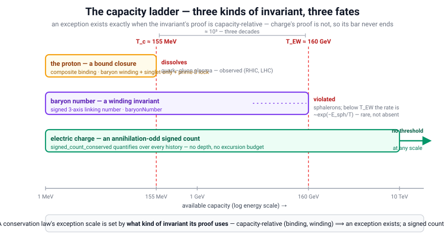

# The Law of Exceptions

> **There is an exception to every restrictive law except this law.**

**Module:** [`lean/QLF_LawOfExceptions.lean`](lean/QLF_LawOfExceptions.lean) — machine-verified, no axiom
**Companions:** [`Philosophy.md`](Philosophy.md) §3a (the method it belongs to) and §3b (the short form) · [`lean/QLF_ClosureDepth.lean`](lean/QLF_ClosureDepth.lean) (the census strata it counts) · [`lean/QLF_HorizonClosure.lean`](lean/QLF_HorizonClosure.lean) (finite capacity) · [`lean/QLF_Realizability.lean`](lean/QLF_Realizability.lean) (the finite-information observer)

---

## §1 What needs proving, and what doesn't

The aphorism is old. *"There is an exception to every rule"* is recorded in English from the late 16th
century, standing behind the Latin `exceptio probat regulam in casibus non exceptis`; the
self-referential twist — *"…except this rule"* — is common folklore with no traceable first author. So
the wording is not the contribution, and shouldn't be claimed as one.

What is *not* folklore is a proof. And the two arguments usually offered do not supply one.

**Self-reference proves nothing.** Write `X(L)` for "`L` has an exception" and let

```
E  ≡  (∀L. L ≠ E → X(L))  ∧  ¬X(E)
```

Assuming `E`, one can indeed derive that `E` is the *unique* exceptionless law: if `¬X(K)` and `K ≠ E`,
the first clause gives `X(K)`, a contradiction, so `K = E`. That uniqueness argument is valid, and it
yields the sharp kill condition of §5. But it is entirely **conditional on `E`** — it assumes the
universal premise it appears to establish. Consistency of "every law but me has an exception" says
nothing about whether any particular law actually has one.

**The set-theoretic version is a tautology.** Let `H` be the generable histories and `A_L ⊆ H` those a
law admits, with `X(L) ⟺ ∃h ∈ H. h ∉ A_L`. Then `A_L ⊊ H ⟹ X(L)`: some `h` lies outside `A_L`, and by
possibilism every generable history is real, so `h` is a real exception. Valid — and empty. It holds for
every conceivable law and every conceivable distribution over histories, which by
[`Philosophy.md`](Philosophy.md) §3a **rule 3** makes it bookkeeping rather than evidence: a claim earns
physical content only when it changes a count of ways. Unpacked, it says *restrictive laws are
restrictive*.

The universal premise has to be earned somewhere else.

---

## §2 Capacity earns it

> **A system with more states can always break a finite closure.**

This is the load-bearing formulation, and it is a statement about **capacity**, not about sentences. On
the substrate a restrictive law is not an abstract subset — it is a **finite closure**: a
finite-capacity horizon `closedAtHorizon R` that admits exactly the histories closing within `R` pruning
passes ([`QLF_HorizonClosure`](lean/QLF_HorizonClosure.lean)). That is the right model because the thing
applying a law is always a finite-information region
([`QLF_Realizability`](lean/QLF_Realizability.lean)): *"observation is bounded closure, not eyeballs."*

Given that, the premise is a theorem. For **every** capacity `R`, take the fold one shell deeper than the
law can prune:

```
exceptionTo R  :=  [ +^(R+1)  −^(R+1) ]
```

| Theorem | Statement |
|---|---|
| [`exceptionTo_not_closed`](lean/QLF_LawOfExceptions.lean) | it is **not admitted** at capacity `R` — `R` passes cannot peel `R+1` shells |
| [`exceptionTo_is_real`](lean/QLF_LawOfExceptions.lean) | yet it **closes at `R+1`** — a genuine closure, not a non-history |
| [`law_of_exceptions`](lean/QLF_LawOfExceptions.lean) | hence **every finite closure has a real exception**, and the witness is *constructed* |
| [`closure_hierarchy_strict`](lean/QLF_LawOfExceptions.lean) | more capacity admits strictly more (monotone by `closedAtHorizon_mono`, strict by the witness) |
| [`no_final_closure`](lean/QLF_LawOfExceptions.lean) | so **no finite closure is final** — the capacity hierarchy never saturates |
| [`no_finite_closure_is_exceptionless`](lean/QLF_LawOfExceptions.lean) | no finite closure is exceptionless (the kill condition, §5) |
| [`no_exception_to_unbounded_closure`](lean/QLF_LawOfExceptions.lean) | every such exception is admitted at *some* capacity |

The second row is what makes this a proof rather than a word game. A law that merely fails on gibberish
has no exception worth the name; the exception here is a **real closure** — the law is not wrong about
what fails to close, it is *blind to a closure deeper than its budget*. And the witness is exhibited with
its depth, so nothing rests on an existence claim.

**What capacity turns out to mean — now exact.** With the depth law
([`closedAtHorizon_iff_maxExcursion_le`](lean/QLF_ClosureDepthLaw.lean), proven, no axiom) the model is
sharp: a capacity-`R` closure admits **exactly** the histories whose phase walk never strays further than
`R` from balance. A finite closure is an **excursion budget**, not a length budget — it can admit
arbitrarily long histories (length `~R²` typically, a balanced walk's mean maximum being `√(πn/2)`) and
still be broken by one short history that strays a single step too far. The exception
`[+^{R+1} −^{R+1}]` is precisely the *shortest* such history.

---

## §3 Why the exception clause is not special pleading

The one law the mechanism cannot bite is the one that **bounds no capacity**. By
[`no_exception_to_unbounded_closure`](lean/QLF_LawOfExceptions.lean), every exception constructed above
closes at *some* capacity — so none of them is an exception to closure as such, only to a finite budget.
ZFA imposes no budget: it is a **selection principle, not a restriction**
([`Philosophy.md`](Philosophy.md) §4), and `qlf_universality` proves it prunes no computable physics —
only the non-terminating tail. In the set formulation, `A_ZFA = H`.

So the exception clause is not a carve-out protecting the law from itself; it is the observation that the
mechanism needs a *finite capacity* to bite, and one law has none. Any law that does restrict — every
particular physical model, every finite theory, every observer's horizon — has a capacity, and therefore
an exception.

---

## §4 Why laws look exceptionless anyway

Because **exceptions are the least-multiplicity histories.** The census strata are counted in
[`QLF_ClosureDepth`](lean/QLF_ClosureDepth.lean): the depth-1 stratum holds `2ⁿ` ways
([`onePass_ways_iff`](lean/QLF_ClosureDepth.lean)) while the maximal depth holds only the nested singlet
and its mirror — two. By the most-ways principle, **what happens in the most ways happens first**, so the
shallow closures dominate overwhelmingly and the deep exception happens *last*.

Quantitatively, the fraction of the census a capacity-1 law admits vanishes as histories lengthen
(exact enumeration, [`census_congestion_freezeout.py`](census_congestion_freezeout.py) part E):

| `n` | 2 | 3 | 4 | 5 | 6 | 8 | 10 |
|---|---|---|---|---|---|---|---|
| admitted at capacity 1 | 0.667 | 0.400 | 0.229 | 0.127 | 0.069 | 0.020 | 0.0055 |

A law can therefore be *nearly always right* and still fail at every scale. This is the reconciliation
the aphorism needs: exceptions are not common, they are **rare and certain** — which is exactly why
laws feel exceptionless right up until they are applied outside the capacity that produced them.

---

## §4a Case in point: the proton

The proton is the sharpest physical instance, because its stability is not folklore — it is
**structurally derived** in this repo, three times over:

* **baryon number is a signed 3-axis winding invariant** — proton `+1`, antiproton `−1`, leptons and
  mesons `0`, with conjugation-oddness proven for *all* histories
  ([`baryonNumber`, `baryon_dagger_odd`](lean/QLF_BaryonWinding.lean));
* **a lone quark cannot close** — only the singlet closes
  ([`charged_not_closed`, `singlet_closure`](lean/QLF_Confinement.lean));
* **the prime-3 lock** — a closure of prime period has no nontrivial sub-closure repeat, so the vacuum
  cannot factor it into a repeat of something shorter
  ([`prime_freq_irreducible`](lean/QLF_PrimeResonance.lean)).

Empirically the proton looks indestructible (lifetime `> 10³⁴` years, Super-Kamiokande), and QLF
**predicts** that: it reproduces minimal `SU(5)`'s good numbers while dropping its fatal fast-proton-decay
prediction ([`Forces_From_Three_Axes.md`](Forces_From_Three_Axes.md) §5a). That prediction stands.

**And yet the proton breaks — because structural is not absolute.** Each lock above is a *finite
closure*, and by §2 a finite closure has a capacity. Raise the available excursion and the exception
appears, as nature already exhibits:

| Capacity raised to | What happens | Status |
|---|---|---|
| `T ≳ T_c ≈ 155 MeV` (`≈ 1.8 × 10¹² K`) | **deconfinement** — the proton is not a closure at all; quarks and gluons roam free | **observed** (RHIC, LHC quark–gluon plasma) |
| above the electroweak crossover (`≈ 160 GeV`) | **baryon number itself violated** — sphaleron transitions (§4b) | standard, and already admitted here ([`Conservation.md`](Conservation.md) §7: QLF carries *no* exact global symmetry beyond the gauge charges, matching Banks–Seiberg / swampland) |

Note the exception's shape: the proton does not *decay*, it **dissolves**. That distinction matters and
must be kept — the Law of Exceptions locates the *capacity* of the stability claim; it does not overturn
the low-energy prediction. Cold proton decay remains unobserved and QLF still predicts its absence.

**This is also the reconciliation of two things the repo asserts.**
[`Mysteries_Of_Physics.md`](Mysteries_Of_Physics.md) lists proton stability as structurally settled (✅);
[`Conservation.md`](Conservation.md) admits `B`-violation at the sphaleron scale. Those are not in
tension once stability is read as a **capacity** claim: the prime lock says nothing can factor the proton
*within its capacity*, and says nothing whatever about capacities that supply more excursion than the
closure can absorb. Every "✅ structurally stable" in this repository should be read that way.

**Why the temperature knob is the capacity knob.** In the freeze-out model, temperature *is* the pruning
budget — `R ~ Poisson(λ(T))`, more heat meaning more passes the local causal diamond affords
([`census_congestion_freezeout.py`](census_congestion_freezeout.py)). So "hotter" and "larger capacity"
are the same variable, and §4's multiplicity reading applies directly: at everyday temperature the
overwhelming majority of ways that close keep the proton bound, so it looks exceptionless; raise `T` and
the deconfined ways come to dominate. What happens in the most ways happens first — and *which* ways are
most is temperature-dependent.

---

## §4b The sphaleron scale, as a capacity — and where the ladder stops

The deconfinement capacity breaks a **composite** closure: above `T_c` the proton is not a closure, but
baryon number survives — the quarks still carry the winding. The sphaleron capacity is a *different and
deeper* kind, and worth separating for that reason: what fails there is **the invariant itself**.

**The scale.** Thermal sphaleron transitions are unsuppressed above the electroweak crossover,
`T_EW ≈ 160 GeV` (lattice: `159.5 ± 1.5 GeV`, D'Onofrio–Rummukainen–Tranberg 2014), where the
zero-temperature sphaleron energy is `E_sph ≈ 9 TeV` (Klinkhamer–Manton). Below the crossover the rate
carries the Boltzmann suppression `~exp(−E_sph/T)`.

**What fails.** Baryon number — which in QLF *is* a signed 3-axis linking (winding) number,
[`baryonNumber`](lean/QLF_BaryonWinding.lean) (proton `+1`, antiproton `−1`, leptons and mesons `0`,
conjugation-odd for all histories) — **changes**. The winding is not protected.

**Why QLF expects this instead of being embarrassed by it.** QLF *proves* that baryon number cannot be a
conserved signed count: [`wcount_zero_on_ZFA`](lean/QLF_BMinusL.lean) shows every annihilation-odd signed
count is **zero on every closure**, yet the proton carries `B = +1`. So `B` is at most a *winding*
quantity — and a winding quantity's conservation is capacity-relative from the start. The sphaleron scale
is simply where that capacity is exceeded. Prediction and observation agree because the **proof was
capacity-relative all along**, which is exactly what §2 says to look for.

**Where the ladder stops.** Electric charge **is** an annihilation-odd signed count, and
[`signed_count_conserved`](lean/QLF_BMinusL.lean) proves it invariant under the ZFA dynamics for *every*
history — no depth, no excursion budget, no capacity anywhere in the proof. So charge has **no** exception,
matching [`Conservation.md`](Conservation.md) §8's "only the gauge charge is exact" (Banks–Seiberg,
swampland). Charge is to the conservation ladder what ZFA is to the law ladder (§3): the unbounded case
the mechanism cannot bite.

**The organizing rule — the payoff.** A conservation law's exception scale is set by *what kind of
invariant its proof uses*:

| Invariant type | Example | Capacity? | Exception |
|---|---|---|---|
| composite binding | the proton as a bound closure | yes | **dissolves** at `T_c ≈ 155 MeV` — observed (RHIC/LHC) |
| winding / topological | baryon number ([`baryonNumber`](lean/QLF_BaryonWinding.lean)) | yes | **violated** above `T_EW ≈ 160 GeV` — sphalerons |
| annihilation-odd signed count | electric charge ([`signed_count_conserved`](lean/QLF_BMinusL.lean)) | **no** | **none** — exact at every scale |


<p align="center"></p>

**What sets each threshold — and why the exceptionless rung is light.** Each rung's threshold sits at
**its sector's carrier-mass scale**:

| Rung | Carrier | Mass scale | Threshold |
|---|---|---|---|
| proton binding | gluons / QCD | `Λ_QCD ≈ 200 MeV` | `T_c ≈ 155 MeV` |
| baryon winding | `W`, `Z` / electroweak | `m_W = 80`, `m_Z = 91`, `v = 246 GeV` | `T_EW ≈ 160 GeV` |
| electric charge | the **photon** | `m_γ = 0` | **none** |

Same scale in each case, to an `O(1)` factor (`T_c/Λ_QCD ≈ 0.8`, `T_EW/v ≈ 0.65`) — those factors are *not*
derived here, only the pattern. And the pattern explains the third rung: **the exceptionless invariant is
the one whose carrier is massless.** In QLF that is close to a tautology in the right units, which is the
point — **mass *is* constructing delay *is* fold depth *is* capacity** (`m = 1/R`; a massless excitation
has no gauge fold, hence zero depth and zero entropy, [`Entropy.md`](Entropy.md) §2). A zero-depth carrier
is a zero-capacity one, so there is no budget to exceed and no threshold to place. Standard physics says
the same thing from the other side: exact `U(1)` ⟺ unbroken gauge symmetry ⟺ massless photon, while the
broken electroweak sector has massive carriers and, exactly there, the violable invariant.

So the unterminated bar in the diagram is **light**. That is not a coincidence of the drawing; it is what
"no capacity" looks like when capacity is depth and depth is mass.

Three decades of scale separate the first two (`160 / 0.155 ≈ 10³`); the third has no scale at all. And
the rule is **falsifiable in both directions**: observing violation of a quantity whose QLF proof is a
signed-count invariant would break it, and showing a winding quantity exactly conserved at all scales
would break it too.

**The suppression factor is literally a ratio of ways.** This makes the sphaleron a *better* illustration
of §4 than deconfinement. Below `T_EW` the rate goes as `exp(−E_sph/T)` — the exception's multiplicity,
relative to the closure-preserving ways, is exponentially small but **nonzero**. "Rare and certain" is not
a slogan here; it is the Boltzmann factor. What happens in the most ways happens first, so the sphaleron
happens exponentially rarely — and it *does* happen: that is baryogenesis
([`Conservation.md`](Conservation.md) §7).

---

## §4c Two ways a bar can end — and light ends the other way

The unterminated bar needs one qualification, because light plainly *does* terminate: it terminates at a
**resonant atom**. That is a different mechanism from the two thresholds above, and the distinction is the
substance rather than a caveat.

| Termination | Mechanism | Direction | Examples |
|---|---|---|---|
| **capacity exhausted** | the invariant maintaining a structure fails once the available excursion exceeds its budget | from **below** — insufficiency | proton dissolves at `T_c`; baryon winding violated at `T_EW` |
| **resonance matched** | the carrier finds a partner it closes with; the frequency matches | by **completion** — sufficiency | a photon absorbed by a resonant atom |

The ladder's energy axis measures the first kind only. Charge — the *invariant* — has no threshold on that
axis. A photon — the *carrier* — always terminates, but by matching, never by exhaustion. Two different
axes, so the two statements do not compete.

**In QLF the termination is constitutive, not the carrier's demise.** A photon is not a projectile that
travels and then stops: it **is** the joint emitter–absorber ZFA closure, existing in the ledger only when
that joint closure completes ([`Photon_Energy_Bits.md`](Photon_Energy_Bits.md) §1,
[`Collective_Electrodynamics.md`](Collective_Electrodynamics.md) §2). So "light terminates at a resonant
atom" is the photon's **existence condition**. The absorber is not what ends it; the absorber is half of
what it is.

**And the reason light must end this way follows from the rung it sits on.** Its capacity is zero — no
gauge fold, no constructing delay, no depth ([`Entropy.md`](Entropy.md) §2) — so there is nothing internal
to exhaust:

> **A zero-capacity carrier can only be terminated by a match, never by exhaustion.**

That is why the massless rung looks unterminated on a capacity axis and is nevertheless always terminated
in fact. The two facts are the same fact seen along two axes.

**The matching is itself a ways-count.** Resonance is not a separate principle here: the atom is a resonant
closure at particular frequencies (`freq R = 1/R`, with prime periods irreducible and higher frequencies
dominant — [`QLF_HarmonicClosure`](lean/QLF_HarmonicClosure.lean),
[`QLF_PrimeResonance`](lean/QLF_PrimeResonance.lean)), and the joint closure completes in **many** ways on
resonance and few off it.

**"Line spectra are multiplicity spectra" — what that survives as.** I asserted it above as a reading; it is
now [`QLF_LineSpectra`](lean/QLF_LineSpectra.lean), which proves the parts that are provable and refuses the
rest. Three separable claims:

| Claim | Status |
|---|---|
| **positions** — a spectrum is a *finite list of lines* | **proven**, and it is **capacity** that does it (`lines_card_le`, `≤ R²`; `lines_mono` — the list grows with capacity). Integrality alone would *not* suffice: over an unbounded census the differences `1/a − 1/b` accumulate arbitrarily finely, so discreteness is a consequence of the finite budget, not of integers |
| **weights** — a level's statistical weight *is* a multiplicity | **proven** — it is the **cardinality** of the orientation set, `orientations_card = orbitalDim ℓ = 2ℓ+1`, not an arithmetic formula that merely matches a count |
| **summed intensities** — lines from a common level stand in the ratio of those counts | **theorem over a cited empirical law** — the **Burger–Dorgelo–Ornstein sum rules** (1924–25; Condon & Shortley), taken as an `IntensityModel` *interface* rather than an axiom, from which `intensity_ratio_is_multiplicity_ratio` follows with the constant cancelling |
| **individual line strengths** are way-counts | **not proven, and withdrawn as stated.** Oscillator strengths and dipole matrix elements are not derived here, and the sum rules constrain only *sums* over a common level. The stronger reading needs the multiplicity ↔ Born-norm bridge — now *partly* closed ([`QLF_BornCounting`](lean/QLF_BornCounting.lean): the exponent is the ket–bra pair, the residue reduced to agreement on primitive closures) but not enough to price an individual line |

So the defensible statement is the first three rows, and my unqualified phrasing above was broader than
what holds. The interesting half is nevertheless the first row: **discreteness is a capacity effect** — the
same finite budget that gives every rung of the ladder its exception is what makes a spectrum a *spectrum*
rather than a smear.

---

## §5 The kill condition

The law is not protected by wordplay. Exhibit any **other** exceptionless law and it is false: by the
uniqueness argument of §1, an exceptionless `K ≠ E` contradicts the universal clause directly, and on the
substrate [`no_finite_closure_is_exceptionless`](lean/QLF_LawOfExceptions.lean) says such a `K` cannot be
any finite closure. So the falsification target is sharp: **a restrictive law with a capacity and no
exception.** Nothing in the framework currently supplies one, and the theorem says nothing finite can.

---

## §6 Not Gödel — and the difference matters

The shape is familiar: no finite axiomatization settles everything, and strengthening one gives a
strictly stronger system, so the hierarchy never closes. That is the structural parallel to Gödel
incompleteness and the Turing progressions of theories, and the capacity ladder here is the same *kind*
of object as a hierarchy of consistency strength.

But the difference is the whole point of QLF's framing, and it should not be blurred:

* **Nothing here is undecidable.** Each exception `[+^(R+1) −^(R+1)]` is a **terminating** history whose
  closure is *decidably* real — it closes at `R+1`, provably. Gödel's witnesses are unprovable
  sentences; ours are constructed closures.
* **The hierarchy is capacity, not consistency.** Widening the horizon costs resolution, not new axioms.
  The exception was always real; the law simply could not see that far.
* **This is why Gödel does not bite here.** QLF's core operates within `RCA₀`, and non-terminating
  computations fail closure and are pruned before they become events ([`Philosophy.md`](Philosophy.md),
  the ZFC ultraviolet catastrophe). The Law of Exceptions is the *finite-capacity* limitation that
  remains after undecidability has been excised — a statement about budgets, not about truth.

Related boundaries elsewhere in the repo have the same capacity character: the continuum as
unrealizable-in-a-finite-region ([`TheContinuum.md`](TheContinuum.md)), Banach–Tarski as consistency
without realizability ([`Banach_Tarski_QLF.md`](Banach_Tarski_QLF.md)), and the finite-computation floor
where the Gödel-II residue is relocated ([`Mathematics_From_QLF.md`](Mathematics_From_QLF.md)).

---

## §7 The methodological corollary

> **Construction proves possibility, not uniqueness.**

This is why the law belongs in the working method and not in a curiosities file. Exhibiting a mechanism
establishes **a way** something happens. Claiming it is *the* way requires an independent completeness
theorem — and by §2 no finite closure supplies one. It is
[`Philosophy.md`](Philosophy.md) §3a rule 4 with a proof underneath it.

Applied honestly to this repository's own results, that means:

* The **nine integer null probes** ([`QLF_NullTensorReconstruction`](lean/QLF_NullTensorReconstruction.lean))
  are *a* sufficient family forcing the metric form — not the only one, and the sharpness result only
  shows this family is minimal in its own shape.
* **Jacobson's route** to the field equations ([`Einstein_Equations.md`](Einstein_Equations.md)) is one
  route; the causal-set order→metric program is another, and their agreement is *multiplicity*, which is
  what makes the result dominant.
* **`log 2`** arises by four independent routes and thirteen re-exports
  ([`Entropy.md`](Entropy.md) §1b) — the inventory exists precisely so the re-exports are not
  miscounted as confirmations.
* Every **bridge axiom** in the [axiom inventory](Open_Problems.md) marks a capacity boundary of the
  present formalization, not a fact about reality.

---

## §8 Honest scope

What is proven is the substrate statement: **every finite-capacity closure has a constructed real
exception, and the capacity hierarchy is strictly increasing.** The step from there to "every restrictive
law whatsoever" rests on the modelling assumption that a restrictive law *is* a finite closure — which is
the content of the capacity formulation, not a further theorem. Reject that model and the aphorism
returns to being an aphorism; accept it and the law is a corollary of `boundedPrune`.

*Attribution: the aphorism is folklore (late-16th-century base form). The capacity formulation — "a
system with more states can always break a finite closure" — and this formalization are Jim's and Amy's.*
