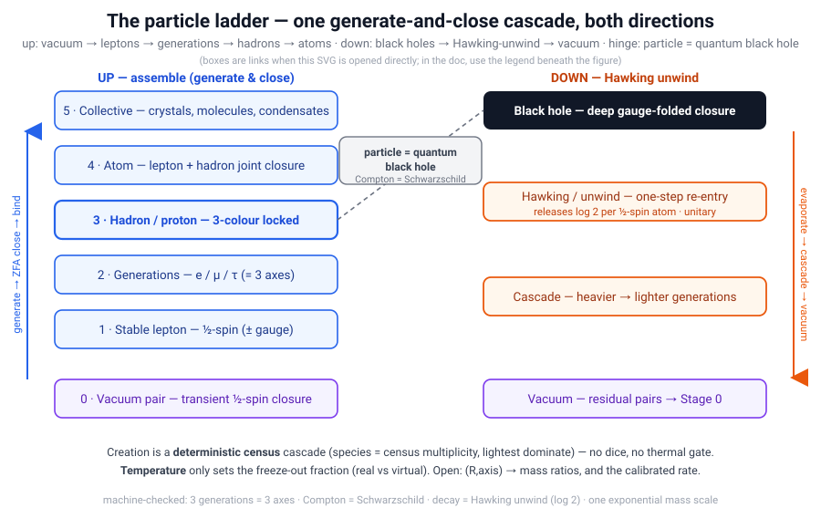

# The Particle Ladder — vacuum ↔ leptons ↔ hadrons ↔ atoms ↔ black holes

> **One generate-and-close cascade, run both directions.** In the [Quantum Logical Framework
> (QLF)](README.md) the same primitive — a ½-spin Zero-Free-Action (ZFA) closure carrying one bit
> — builds *up* from transient vacuum pairs through leptons, generations, hadrons, and atoms, and
> *down* from black holes by Hawking-unwind back to the vacuum. This document assembles pieces that
> already live across the repo into one coherent ladder, and marks honestly what is **machine-checked**,
> what is **structural** (prose/numeric), and what is **open**.

**Honest framing up front.** QLF already has the *primitives* and most *rungs* of this ladder as
verified or structural results. What is **not** yet done is (a) an explicit map from topological
depth/axis to the observed mass ratios along the *whole* chain, and (b) a temperature-dependent
pair-production *rate* derived from the census. Those are named open, not glossed. So this is a
**synthesis + honest ledger**, in the style of [`Mysteries_Of_Physics.md`](Mysteries_Of_Physics.md)
and [`Information_Physics.md`](Information_Physics.md) — not a claim that the full ladder is proven.

**Status at a glance** (full detail in §5):

| Rung / claim | Status |
|---|---|
| ½-spin atom = one bit, `ΔF = −log 2` | ✅ machine-checked |
| 3 generations = 3 axes; Koide `⟹ m_τ` | ✅ machine-checked |
| baryon needs all 3 colours (confinement) | ✅ machine-checked |
| particle = quantum black hole (Compton = Schwarzschild) | ✅ machine-checked |
| decay = Hawking unwind, `log 2` released per unlock | ✅ machine-checked |
| mass spectrum = one exponentially-generated scale | ✅ machine-checked |
| bound-state atoms · fusion channel opening · temperature → stable rung | ◻ structural / modeled |
| pair-production mechanism (deterministic census + thermal freeze-out) | ◻ modeled — constructor + [`pair_production_demo.py`](pair_production_demo.py) |
| **`(R, axis) → observed mass ratios`** along the full chain | 🔵 **open — the priority gap** |
| **analytic pair-production rate calibrated to measured onsets** | 🔵 open |

> The diagram is a static picture — GitHub can't make image regions clickable. **The per-box links to the QLF explanation of each layer are the table just below** (each doc in turn links to the live constructor).

**Each ladder box → its QLF explanation:**

| Ladder box | QLF explanation of that layer | live |
|---|---|---|
| **0 · Vacuum pair** | [`Creation.md`](Creation.md) — creation = separation of nothing into conjugate pairs (why the first distinction is two-valued) | [▶ e⁺e⁻](https://jimscarver.github.io/quantum-logical-framework/spacetime_constructor.html#qc=positronium%20%40%200%2C0%2C0) |
| **1 · Stable lepton (½-spin)** | [`Spin_QLF.md`](Spin_QLF.md) — spin *is* the twists; the ½-spin closure | |
| **2 · Generations e/μ/τ** | [`Standard_Model.md`](Standard_Model.md) — three generations = the three spatial axes | |
| **3 · Hadron / proton** | [`Quarks.md`](Quarks.md) — colour = the three axes; Borromean confinement | |
| **4 · Atom** | [`Bound_States_QLF.md`](Bound_States_QLF.md) — atoms as bound joint-ZFA closures (the real observables) | [▶ H](https://jimscarver.github.io/quantum-logical-framework/spacetime_constructor.html#qc=H%20%40%200%2C0%2C0) |
| **5 · Collective** | [`Chemistry.md`](Chemistry.md) — one valence rule; crystals, condensates | |
| **Black hole** | [`BLACK-HOLES.md`](BLACK-HOLES.md) — finite interiors, no singularity | |
| **Hawking / unwind** | [`Hadron_BlackHoles.md`](Hadron_BlackHoles.md) — hadron = quantum black hole; decay = Hawking evaporation | |
| **Cascade** | [`Decay.md`](Decay.md) — the census-exponential prime-slip cascade | |
| **Vacuum (return)** | [`Creation.md`](Creation.md) §8a — the logical bang / Stage 0 | |
| **Hinge · particle = quantum BH** | [`Hadron_BlackHoles.md`](Hadron_BlackHoles.md) — Compton = Schwarzschild (`QLF_QuantumBlackHole`) | |
| *Dynamics* | [`pair_production_demo.py`](pair_production_demo.py) — census creation + freeze-out | [▶ full cascade](https://jimscarver.github.io/quantum-logical-framework/spacetime_constructor.html#t=0.95) |

---

## 1. The primitives (each already anchored)

| Primitive | What it is | Anchor |
|---|---|---|
| **The atom of the ladder** | one ½-spin ZFA Hermitian pair (bra-ket closure folding to `±I`); carries exactly one bit, `ΔF = −log 2` | `QLF_SpinorInformation`, `QLF_FreeEnergy` ([`Information_Physics.md`](Information_Physics.md)) |
| **Gauge fold `+−`** | a closure carrying a constructing delay `Δt = R/f` → local time + a Planck-scale Markov blanket (a primordial quantum-black-hole seed) | `QLF_PlanckScale` (`planck_self_dual`, `coherent_iff_subplanck`) |
| **Depth `R` / frequency `f`** | number of nested/sequential folds; sets the mass–frequency scale (`m = ℏf/R`) and the local clock rate (`f = 1/t`) | [`Per_Qubit_Mass_Quantum.md`](Per_Qubit_Mass_Quantum.md), [`Time.md`](Time.md) |
| **Three axes** | the three spatial twist axes generate the three fermion generations | `num_generations_eq_three`, `generations_from_three_axes_constructive` ([`lean/QLF_Generations.lean`](lean/QLF_Generations.lean)) |
| **Temperature = logical density** | *precisely:* the local ZFA-closure rate (equivalently the inverse latency, `f = 1/latency`); it does **not** create pairs (the census does, §2) — it sets the **freeze-out fraction** of created pairs that persist as real vs virtual | [`Time.md`](Time.md), [`QLF_FreeEnergy`](lean/QLF_FreeEnergy.lean), [`Spacetime_Constructor.md`](Spacetime_Constructor.md) |

**The particle = micro-black-hole identity is proven.** A closure is a Markov-blanket horizon; the
Compton radius equals the Schwarzschild radius exactly at the Planck mass (`compton_eq_schwarzschild_iff`,
[`lean/QLF_QuantumBlackHole.lean`](lean/QLF_QuantumBlackHole.lean)), so **every hadron is a quantum
black hole** and a particle's decay is that black hole's Hawking evaporation
([`Hadron_BlackHoles.md`](Hadron_BlackHoles.md)). This is the hinge that lets the *same* ladder run
from particles to black holes and back.

---

## 2. The upward ladder — vacuum → atoms

| Stage | Object | Structure / depth | QLF status |
|---|---|---|---|
| **0. Vacuum fluctuation** | transient pair (e.g. `e⁺e⁻`), a horizon-open/unbalanced closure | `R ≈ 1`, short-lived | ✅ conjugate-pair closure (`ER_EPR_QLF`, `conjugate_pair_closes`); **promotion rate open** |
| **1. Stable lepton** | one ½-spin (+ optional gauge fold) | `R` small | ✅ spin = twists (`QLF_Spin`); ν is Majorana (`neutrino_majorana`), e is Dirac |
| **2. Heavier generations** | same topology, deeper fold / higher-frequency axis | axis 2, 3 | ✅ **3 generations = 3 axes** (`num_generations_eq_three`); Koide `Q=2/3 ⟹ m_τ` (`three_generations_satisfy_koide`); free-lepton mass *ratios* not the observable (bound systems are) |
| **3. Hadron / proton** | three-axis colour-locked closure + gauge (Borromean) | `R` larger | ✅ **needs all three colours** (`baryon_needs_all_three_axes`, `single_colour_not_baryon`); confinement = a topological necessity; hadron = quantum BH (`compton_eq_schwarzschild_iff`) |
| **4. Atom** | lepton + hadron complementary joint-ZFA closure | bound state | ✅ structural — the QLF observable is the *bound* system (positronium/muonium/hydrogen), not the free lepton ([`Bound_States_QLF.md`](Bound_States_QLF.md)) |
| **5. Collective** | many atoms phase-locked | crystal / molecule / condensate | ✅ chemistry (one valence rule), crystals (Pauli), Cooper/BEC ([`Chemistry.md`](Chemistry.md), `QLF_CondensedMatter`) |

**Promotion rule (virtual → real) — two parts, and the split matters.** This is subtler than "heat
makes pairs," and the constructor already gets it right (reproduced outside the browser in
[`pair_production_demo.py`](pair_production_demo.py)):

- **Creation is a *deterministic census* cascade — no dice, no thermal gate.** Pairs are read out of
  the census by frequency (`m = 1/R`), so the *species ratios are the census multiplicities* —
  lightest dominate (`e⁺e⁻ : μ⁺μ⁻ : p p̄` in the illustrative model ≈ `0.90 : 0.075 : 0.025`), **not**
  a Boltzmann factor. "The census draws the space" (`QLF_CensusBrownian` / `QLF_BornProbability`).
- **Temperature only sets the *freeze-out fraction* — real vs virtual.** A created pair persists as
  **real** matter with a fraction that rises with the local logical density (temperature); at `T=0`
  every pair is virtual foam, near the Planck top ~97% are real. Persisting one bit still pays
  `ΔF = −log 2`. So heating does not *make* the heavier species — it lets more of the already-drawn
  census *stay*.

**Open:** calibrating the census buckets to the *measured* onsets (`e⁺e⁻ ~10¹⁰ K`, then `μ`, then `p`)
and deriving the freeze-out fraction analytically from the census — the constructor's edges are
illustrative, the *mechanism* is the QLF content (§5).

**Generation rule.** The three generations are the *same* topological pattern realized on the three
independent spatial axes (`generations_from_three_axes_constructive`). That the count is exactly three
is proven; the **mass ratios** `m_e : m_μ : m_τ` as functions of depth/axis are the open quantitative
target — QLF fixes one relation (Koide) and the *structure* (one scale, exponentially generated,
`spectrum_one_scale`, `log_transmuted_hierarchy`, [`lean/QLF_MassSpectrum.lean`](lean/QLF_MassSpectrum.lean)),
not the full ladder of ratios (`mass_spectrum_in_progress`).

---

## 3. The downward ladder — black holes → vacuum

The particle↔black-hole identity (§1) makes the descent the *same* ladder run in reverse:

| Stage | Process | QLF reading |
|---|---|---|
| **Black-hole seed** | a deep gauge-folded closure with a horizon blanket | primordial quantum BH (a particle *is* a micro-BH; `compton_eq_schwarzschild_iff`) |
| **Hawking / unwind** | one-step horizon re-entry of `+−` folds | pair emission; each unwound ½-spin atom **releases exactly `log 2`** back to the vacuum (`unlock_releases_log_two`, [`Annihilation.md`](Annihilation.md)) — unitary, charge/`J` preserved |
| **Cascade** | sequential unlocking of nested folds (prime phase-slip) | heavier → lighter generations, the reverse of §2 (`prime_slip_is_quarter_turn`, `collective_dump_positive`, [`lean/QLF_PrimeCascadeDecay.lean`](lean/QLF_PrimeCascadeDecay.lean); [`Decay.md`](Decay.md)) |
| **Final** | residual ½-spin pairs or pure vacuum | return to Stage 0 |

**Nested blankets → recursive cosmology without singularity.** Because a black-hole interior is a
child Markov blanket, it can host its own ladder — the *logical bang* drawn from inside
([`Creation.md`](Creation.md) §8a, `QLF_LogicalBang`), a fresh Stage-0 at the collapsed floor rather
than a metric singularity (`planck_length_floor`).

---

**Falsifiability.** The ladder's structural commitments are sharp enough to break:

| Observation | Verdict |
|---|---|
| a **fourth fermion generation** | ❌ tension with 3 generations = 3 axes (`num_generations_eq_three`) |
| a definitive **Dirac neutrino** (0νββ excluded) | ❌ tension with the Majorana Stage-1 lepton |
| a **new fundamental particle at the hadron scale** (WIMP-like) | ❌ against "hadron = quantum BH, no extra particle spectrum" |
| a **stable free quark** | ❌ refutes colour-locked confinement (`single_colour_not_baryon`) |
| black-hole evaporation shown **non-unitary** (information lost) | ❌ against the closure/unwind reading (`unlock_releases_log_two`) |

---

## 4. The one dynamics — generate, close, and temperature

The whole ladder is a single loop, both directions:

- **Generate.** The QuCalc engine expands every admissible twist history (the path-integral *generate* step).
- **Select.** Only ZFA-balanced histories persist (`full_zeno_prune` — the *firebreak*).
- **Temperature = logical density.** Which depth/`R` is stable is set by the local closure rate; heating shifts the stable rung up the ladder (pair thresholds), cooling lets it recombine down (atoms, then chemistry).
- **Cascade.** Prime-/depth-synchronized unlocks produce the sequential transitions (§3).
- **Photon.** Every emission/absorption is a joint-ZFA handshake, not a flying projectile ([`Collective_Electrodynamics.md`](Collective_Electrodynamics.md)).

**This is not a thought experiment — it runs.** The [interactive constructor](https://jimscarver.github.io/quantum-logical-framework/spacetime_constructor.html) *is* this ladder: heat the vacuum toward the Planck top and watch **black holes form → Hawking-cascade into hadrons → cool into nuclei → recombine into atoms → do chemistry**, from the census alone, nothing scripted ([`Spacetime_Constructor.md`](Spacetime_Constructor.md)).

- [▶ heat to the Planck top — the full cascade](https://jimscarver.github.io/quantum-logical-framework/spacetime_constructor.html#t=0.95)
- [▶ a transient e⁺e⁻ vacuum pair](https://jimscarver.github.io/quantum-logical-framework/spacetime_constructor.html#qc=positronium%20%40%200%2C0%2C0) · [▶ an α (⁴He) closure](https://jimscarver.github.io/quantum-logical-framework/spacetime_constructor.html#qc=alpha%20%40%200%2C0%2C0) · [▶ a hydrogen atom](https://jimscarver.github.io/quantum-logical-framework/spacetime_constructor.html#qc=H%20%40%200%2C0%2C0)

---

## 5. The scorecard — proven, structural, open

**✅ Machine-checked (the rungs and the hinge):**
- the ½-spin atom carries one bit / `ΔF = −log 2` (`QLF_SpinorInformation`, `QLF_FreeEnergy`);
- **3 generations = 3 axes** (`num_generations_eq_three`); Koide `⟹ m_τ` (`three_generations_satisfy_koide`);
- **baryon needs all three colours**; confinement (`baryon_needs_all_three_axes`, `single_colour_not_baryon`);
- **particle = quantum black hole**; Compton = Schwarzschild at the Planck mass (`compton_eq_schwarzschild_iff`);
- **decay = Hawking unwind**, each unlock releasing `log 2` (`unlock_releases_log_two`, `collective_dump_positive`);
- the Planck closure floor — no singularity (`planck_length_floor`, `planck_self_dual`);
- the mass spectrum is **one scale, exponentially generated** (`spectrum_one_scale`, `log_transmuted_hierarchy`).

**◻ Structural (prose / numeric, mechanism anchored, value not derived):**
- bound-state atoms (positronium/muonium/hydrogen) as the QLF observables ([`Bound_States_QLF.md`](Bound_States_QLF.md));
- the fusion rungs — `pp` Pauli-blocked, the `pn`/deuteron channel opens (`diproton_pauli_blocked`, `deuteron_channel_closes`);
- the temperature → stable-rung correspondence, demonstrated in the constructor but not analytically derived.

**🔵 Open (real research, not doc-work — do not fake):**
- **The priority gap — the ladder mass map `(R, axis) ↦ observed mass ratio`.** QLF fixes the *count*
  (3 generations), *one* relation (Koide `Q=2/3`), and the *exponential structure* (`spectrum_one_scale`,
  `log_transmuted_hierarchy`), but **not** the full ratio ladder `m_e:m_μ:m_τ:m_p` as an explicit
  function of fold depth and axis (`mass_spectrum_in_progress`). *Suggested Lean target:* a `depth`/`axis`
  → mass-ratio function reproducing the Koide relation as a special case and the measured `m_μ/m_e`,
  `m_τ/m_μ` to stated precision — the honest next module for this ladder.
- **The pair-production rate** — the *mechanism* is modeled (deterministic census creation + thermal
  freeze-out, [`pair_production_demo.py`](pair_production_demo.py)); **open** is calibrating the census
  buckets to the measured onsets and deriving the freeze-out fraction analytically from the census.
- absolute mass scale (`v = R_stable`, frontier #1, [`Open_Problems.md`](Open_Problems.md)).

**Deliberately *not* built:** a "unified Lean module" for the ladder. It would be reuse-only — re-exporting the theorems above with no new content — so it is not worth a module. The ladder's value is as this synthesis; each rung is already verified in its own module.

---

## See also

- [`Bound_States_QLF.md`](Bound_States_QLF.md) — free leptons are not QLF observables; atoms are (Stage 4).
- [`Decay.md`](Decay.md) · [`Annihilation.md`](Annihilation.md) — the downward ladder; decay = Hawking unwind, `log 2` released per atom.
- [`BLACK-HOLES.md`](BLACK-HOLES.md) · [`Hadron_BlackHoles.md`](Hadron_BlackHoles.md) — the particle = quantum-black-hole identity, the hinge of the two directions.
- [`HALF-SPIN-ZFA-EMBEDDING.md`](HALF-SPIN-ZFA-EMBEDDING.md) · [`Spin_QLF.md`](Spin_QLF.md) — the ½-spin atom.
- [`Creation.md`](Creation.md) §8a — the logical bang; Stage 0 and nested-blanket recursion.
- [`Information_Physics.md`](Information_Physics.md) — each rung a closure carrying bits; `it from bit`.
- [`Spacetime_Constructor.md`](Spacetime_Constructor.md) — the ladder, running live, temperature-driven.
- [`Open_Problems.md`](Open_Problems.md) — the open quantitative rungs, kept in sync.
